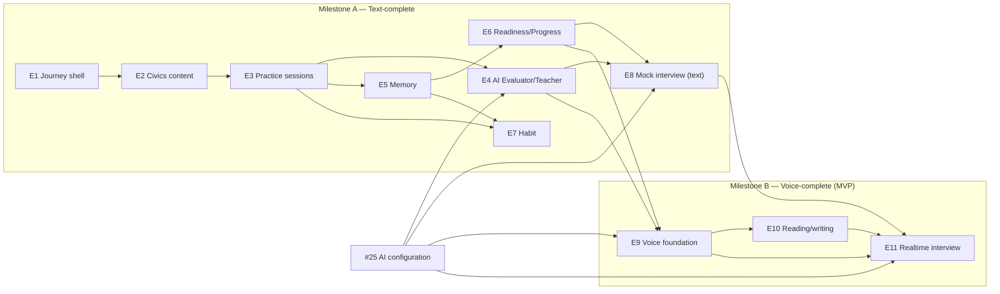

# OathPath Roadmap

## 1. Purpose and how to update

This file tracks **epics only**. It exists so anyone — a new contributor, an
agent picking up work, the next planning session — can see the whole MVP in
one place without reading eleven issue bodies first. Children (the checklist
items inside each epic) live on the epic issues, not here; duplicating them
in this file would just give them a second place to go stale.

Update this file when:

- **An epic opens or closes.** Change its row in the [epic table](#3-the-epic-table)
  — status moves `not started` → `in progress` → `done` — and update the
  milestone note in [§2](#2-what-the-mvp-is) if the epic closes a milestone.
- **A locked decision changes.** Add a dated entry to the [decision
  log](#9-decision-log). Do not silently edit an earlier entry; a locked
  decision that changes is itself worth a record, including *why* it changed.
- **A new epic is added**, or the dependency graph in [§5](#5-dependency-graph)
  changes because a later epic's scope moved.

This file does not restate an epic's implementation detail. If a fact here
and a fact on the epic issue disagree, the issue is authoritative — fix this
file to match it, not the other way around.

---

## 2. What the MVP is

The repository began as a hardened SaaS shell: OAuth authentication, RBAC, a
settings hub, notifications, storage, encrypted credentials, and a first-party
CLI, with **zero product domain code**. `VISION.md` and `PRD.md` describe the
product that shell is meant to carry, and eleven epics (E1–E11) decompose it
into buildable, independently testable slices.

Two foundations are now on `main`. The AI configuration epic (#25) shipped
server model-role bindings and per-user BYOK keys. **E1 (#50) shipped the
journey shell** — the four destinations, the `Clock` provider,
`civics_test_versions`, `learner_profiles`, orientation and home's
`nextAction` contract. What is still missing is the domain itself: there is
no question, no practice session and no readiness score. That is what E2
onward build.

The MVP ships in two milestones.

**Milestone A — "Text-complete" (E1–E8).** A learner can learn the material,
practise it, be graded semantically, be scheduled for review, see explainable
readiness, build a habit, and rehearse the interview — all in text. This is a
usable release: every `VISION.md` product loop (learn → practise → recall →
retain) closes end to end. It is not the full vision, because nothing in it
has ever asked the learner to say an answer aloud.

**Milestone B — "Voice-complete" (E9–E11) — the MVP.** Voice is *inside* the
MVP, not a release after it. The reason is structural, not a feature
preference: E6's readiness model deliberately **caps** a learner's score
while there is no spoken-answer evidence and no mock-interview evidence, no
matter how strong their typed civics performance is. Ship Milestone A alone
and every learner's ceiling reads the same regardless of how much they
practise — the product would tell every learner it cannot say whether they
are ready, which is the exact failure `VISION.md` names as the reason
OathPath exists:

> "How do I know that I am actually ready for my citizenship interview?"

A learner who has never spoken an answer aloud, and never sat a mock
interview, has not produced the evidence the readiness model requires to
lift its cap. `VISION.md`'s "Voice and Text Are Equal Citizens" is not
decorative — it is why Milestone B closes the MVP rather than following it as
a v2.

---

## 3. The epic table

| Order | Epic | Slice | Depends on | Status | Issue |
|---|---|---|---|---|---|
| — | AI configuration | Server model-role bindings (admin) plus mandatory per-user BYOK OpenAI keys; the one door (`AiDispatchService`) every later AI feature calls through | Foundation — required before E4, E8, E9, E10, E11 | done | [#25](https://github.com/marinoscar/oathpath/issues/25) |
| E1 | Journey shell | Four-destination navigation (Home, Learn, Practice, Progress), the `Clock` provider, the learner profile (test version, senior exemption, interview date, state, goal), orientation, and home's `nextAction` contract | — | done | [#50](https://github.com/marinoscar/oathpath/issues/50) |
| E2 | Civics content | The versioned, provenance-tracked USCIS question bank for both test versions, dynamic answers with effective dates, and the Learn page | E1 | in progress<sup>†</sup> | [#51](https://github.com/marinoscar/oathpath/issues/51) |
| E3 | Practice sessions | Deterministic (exact-match + normalisation) practice loop and `practice_attempts`, the one evidence table every later epic reads | E1, E2 | not started | [#52](https://github.com/marinoscar/oathpath/issues/52) |
| E4 | AI Evaluator and Teacher | `AiDispatchService.run`, the `FakeAiProvider`, semantic grading with failure causes, streaming explanations — the first AI feature | #25, E2, E3 | not started | [#53](https://github.com/marinoscar/oathpath/issues/53) |
| E5 | Memory | Spaced repetition (`question_mastery`), verified mastery (correct on ≥3 distinct days), the deterministic Study Coach recommender, Progress v1 | E1, E3 | not started | [#54](https://github.com/marinoscar/oathpath/issues/54) |
| E6 | Readiness and Progress | The explainable, capped readiness score (`readiness_snapshots`), Progress v2, the readiness-vs-engagement separation | E3, E5 | not started | [#55](https://github.com/marinoscar/oathpath/issues/55) |
| E7 | Habit | Daily goal, streaks with protection, session-end celebrations, three reminder notification events on an hourly cron | E1, E3, E5 | not started | [#56](https://github.com/marinoscar/oathpath/issues/56) |
| E8 | Mock interview — text mode | Deterministic interview engine (question selection, pass rules from `civics_test_versions`), text-mode interview and debrief — closes Milestone A | #25 (for `tutor`), E4, E6 | not started | [#57](https://github.com/marinoscar/oathpath/issues/57) |
| E9 | Voice foundation | `transcribe`/`speak` wired, audio capture and playback, spoken practice mode with transcript confirmation, misheard-vs-wrong distinction — opens Milestone B | #25, E4, E6 | not started | [#58](https://github.com/marinoscar/oathpath/issues/58) |
| E10 | Reading and writing tests | Vocabulary-sourced sentences, word-error-rate reading scoring, dictated writing scoring, the readiness `english` component | E9 | not started | [#59](https://github.com/marinoscar/oathpath/issues/59) |
| E11 | Realtime voice interview | `realtime` wired, ephemeral session tokens, the E8 engine driving a realtime model over tool calls — closes Milestone B and the MVP | #25, E8, E9, E10 | not started | [#60](https://github.com/marinoscar/oathpath/issues/60) |

Status legend: `not started` — no child issue in progress; `in progress` —
at least one child issue has an open PR or merged work; `done` — the epic
issue is closed, CI is green on `main`, and the person who did the work has
run the epic's Playwright journey spec locally against the compose stack and
reported it passing (see [§6](#6-definition-of-done-per-epic) — this is a
human check, not something `main` being green on GitHub implies by itself).

<sup>†</sup> **E2: all ten child issues are merged and CI is green on `main`,
but the epic is deliberately not marked `done`.** Two of this section's
criteria are human checks that have not happened yet:

1. **`civics-learn.spec.ts` has never been executed.** It was written against
   the real component sources and it typechecks and registers, but the
   environment it was authored in had no Docker daemon, so nobody has run the
   walk against the compose stack.
2. **The civics content is not human-verified.** `uscis.gov` was unreachable
   when the content files were written, so `civics-2008.json` ships as an
   `UNVERIFIED_MODEL_DRAFT` — every officeholder answer is a
   `[DRAFT PLACEHOLDER]` string rather than a name — and `civics-2025.json`
   ships `AWAITING_SOURCE` with zero questions. The loader refuses to load
   either without `CIVICS_ALLOW_UNVERIFIED_CONTENT=true`, and refuses
   outright under `NODE_ENV=production`, so this cannot reach a learner by
   accident. Closing it needs a human with the official USCIS PDFs; see
   [`docs/runbooks/updating-civics-content.md`](docs/runbooks/updating-civics-content.md).

---

## 4. Why this order

**Navigation and home first, because nothing else has a place to live.**
`VISION.md` requires the home screen to answer three questions on every
open — *Where am I? What should I do next? Am I becoming more ready?* — and
today's `/` is a template dashboard that answers none of them. E2's Learn
page, E3's Practice destination, E5's real Next-up card and E6's readiness
widget all need a destination and a `nextAction` contract to attach to
before they can exist. Building the shell first also means the learner
profile — test version, state, interview date, senior exemption — is
collected once, in E1, rather than being reinvented per epic; E8's interview
engine and E2's dynamic answers both read directly from it.

**Truth before AI.** `VISION.md` and `PRD.md` both state the rule OathPath is
built around: *OathPath owns the truth, AI owns the interaction.* E4's
grader and tutor roles ground every judgment and every explanation in
content read from the database — they cannot do that until E2 has loaded the
official USCIS questions and accepted answers into versioned, human-verified
tables. Building E4 before E2 would leave the evaluator no choice but to
grade against a model's memory of civics facts, which is the exact failure
the foundational rule forbids.

**Deterministic before AI.** E3 ships exact-match-plus-normalisation grading
with no AI dependency at all, before E4 adds semantic grading on top of it.
This ordering is what lets AI **degrade** the product rather than **break**
it: when a user has no BYOK key configured, or an admin has not bound the
`grader` role yet, the practice loop set up in E3 is still correct and still
usable — E4 only makes it better. Reversing the order would make AI
load-bearing for the most frequently exercised loop in the product, the
opposite of what "AI Everywhere, Chatbot Nowhere" asks for.

**Memory before readiness.** `PRD.md` names retention as a readiness signal,
and `VISION.md` is explicit that mastery must be *verified*, not *assumed*,
from repeated correct answers spread across distinct days. E6's readiness
engine has nothing to score until E5's `question_mastery` table exists to
measure retention, remediation, and coverage over time — a readiness number
computed directly from raw `practice_attempts` rows, with no scheduling
layer beneath it, would reward a single cramming session as if it were
durable knowledge, exactly the manufactured confidence `VISION.md` rules
out.

**Voice last, but inside the MVP, because it is the hardest and depends on
everything before it.** E9, E10 and E11 each build on primitives multiple
earlier epics establish — the AI dispatch path (E4), the attempt schema's
`input_mode`/`prompt_mode` columns (E3), the readiness components declared
and left at zero (E6), the deterministic interview engine (E8). Sequencing
them last is an engineering necessity, not a product afterthought: E6's
readiness cap is precisely what keeps voice from becoming optional. A
learner capped at a middling score with perfect typed civics performance has
a concrete, visible reason to do E9's spoken practice and E11's realtime
interview — the product structure itself pulls the learner toward the
milestone that completes it.

---

## 5. Dependency graph



---

## 6. Definition of done, per epic

An epic is `done` only when all of the following hold. They split into what
CI actually checks and what a human has to check instead, because nothing in
`.github/workflows/ci.yml` starts a database or a browser — see
`docs/TESTING.md`'s "What Runs Where" section. Conflating the two is exactly
the mistake this section used to make: a criterion nothing automated verifies
is not a gate, and a PR description should never imply otherwise.

**Verified by CI** (three jobs — `api`, `web`, `cli` — each running typecheck,
tests, and build against a real Nest `AppModule` with Prisma mocked in full;
no database, no other services, no browser):

1. **API tests pass.** Jest + Supertest coverage for every new endpoint,
   guard, and service method, against the mocked Prisma layer — never a real
   database (`docs/TESTING.md`).
2. **Web tests pass.** Vitest + React Testing Library coverage for new
   components, hooks, and pages.
3. **All three workspaces typecheck and build.**

**Verified by a human, before the PR is opened for review, and stated in the
PR description** (the PR template's Testing section asks for exactly this):

4. **Migration applies on a fresh database.** `npx prisma migrate deploy`
   (or the project's `prisma:migrate` script) succeeds against an empty
   database with no manual intervention, and the seed loader — where the
   epic adds one — is idempotent on a second run. Nothing in CI runs this,
   because CI has no database to run it against.
5. **The epic's Playwright journey spec passes locally against the compose
   stack.** Each epic names its own spec file in its child-issue list (for
   example `journey-shell.spec.ts`, `practice-session.spec.ts`,
   `mock-interview-text.spec.ts`) and the person doing the work runs it by
   hand — `docker compose up`, then `npx playwright test` from `tests/e2e/`
   — and records the result in the PR. This is a real, expected deliverable
   per epic, and it is a discipline the author follows, not a gate anything
   enforces: no CI job runs it, and none will, because a Playwright suite
   drives the real application and therefore needs a live database, which
   would break the hermetic, no-database guarantee every other suite relies
   on (`docs/TESTING.md`, and the "No test may run against a database" rule
   in [§7](#7-cross-cutting-rules)).

**Always, regardless of who checks it:**

6. **Docs are updated.** `CLAUDE.md`, `docs/API.md`,
   `docs/SECURITY-ARCHITECTURE.md`, and any design spec the epic introduces
   under `docs/specs/` reflect what actually shipped, not what the design
   spec originally proposed.
7. **A one-paragraph demo script is posted on the epic issue.** A concrete
   walkthrough — log in, do X, see Y — that anyone can follow to see the
   slice working, not a restatement of the acceptance criteria.

**Slice order inside an epic**, matching the commit-cadence rules in
`CLAUDE.md`:

```
docs(specs) → feat(db) → feat(api) → feat(web) → test(tests) → docs
```

A design spec lands before any code, matching the pattern
`docs/specs/ai-settings.md` and `docs/specs/vps-deploy.md` already
establish: the spec is what the epic's child issues build *against*, and it
is committed and reviewable before the first migration exists.

---

## 7. Cross-cutting rules

These rules bind every epic from E1 onward. They are restated here, with
their reasoning, because an epic that violates one of them is not "different
in a good way" — it has reopened a decision the roadmap already made.

**OathPath owns the truth.** Official content — civics questions, accepted
answers, test versions, current dynamic answers — is read from the database
and placed into a model's prompt as grounding context. A model is never
asked *for* a fact; it is asked to reason, explain, or evaluate against a
fact OathPath already holds. This is `VISION.md`'s and `PRD.md`'s
foundational rule, and it is why E2 (content) is sequenced before E4 (the
first AI consumer).

**All AI goes through `AiDispatchService.run(userId, role, request)`**
(E4/#53), on the **caller's** BYOK key. The server key at address `('ai',
'openai')` exists only to populate the admin's model catalog and to prove
connectivity from the admin test — never for inference, and there is no
fallback to it when a user's own key is missing or a role is unbound.
Consequence: **no background job may call AI on a user's key**, because a
user's key is not available outside a request from that user. This is the
direct reason nothing AI-driven runs on cron — the nightly readiness
recompute (E6) and the hourly reminder cron (E7) are both deterministic.

**No new permission strings.** The permission set is closed:
`system_settings:read/write`, `users:read/write`, `rbac:manage`,
`allowlist:read/write`, `storage:*`
(`apps/api/src/common/constants/roles.constants.ts`). Every admin page an
epic adds — civics dynamic answers (E2), AI settings (#25) — reuses
`system_settings:read`/`write`. Every per-user endpoint is `@Auth()` with no
permission at all, resolving the acting user from `@CurrentUser('id')` and
never from a route parameter or request body — the same shape
`email-settings.controller.ts` and the BYOK key endpoints already use. A new
permission string costs a seed change, a re-seed, and an update to every
existing Admin role; nothing in eleven epics needs one.

**Registry idiom.** Destinations, settings cards, notification events,
journey stages, and AI model roles are each declared exactly **once**,
API-owned wherever the web also needs the same fact — the option-1 reasoning
already documented in `apps/api/src/notifications/notification-events.ts`.
E1's `journey/stages` endpoint, E7's `NOTIFICATION_EVENTS` entries, and #25's
`AI_MODEL_ROLES` all follow this shape. `packages/shared` stays
rebrand-only — it is not where product registries live.

**Every settings page is a registry card plus a route, never a new tab.**
Per `CLAUDE.md`'s Settings UI Pattern: E2's civics dynamic-answers page,
E7's reminder-time preference, and #25's AI settings pages each get a
`SettingsCardDef` in `adminSections.tsx` or `userSettingsSections.tsx` and a
route — not a tab bolted onto an existing settings page. Tabs remain
legitimate only for genuinely parallel content inside one destination (the
Users/Allowlist example CLAUDE.md gives); a settings surface is never that.

**One evidence table.** `practice_attempts` (E3) records every answered
question — ordinary practice and mock interview alike — distinguished by its
`source` column. E8's interview turns write into the same table rather than
a parallel one, so E5's mastery scheduler and E6's readiness engine each
read one source instead of a `UNION` over two. This is why `source`,
`input_mode`, and `prompt_mode` are on the table from E3, not added later:
retrofitting them onto live attempt rows would be strictly more expensive
than the two extra columns cost up front.

**No job queue.** Scheduling (E5) and readiness recompute (E6) run
synchronously, inside the request or transaction that produces the evidence.
Reminders (E7) and the nightly readiness pass (E6) run on `@nestjs/schedule`
cron, following the `token-cleanup.task.ts` pattern. The "WHY NOT A QUEUE"
rationale lives in `apps/api/src/notifications/notifications.service.ts` and
applies unchanged here — the volumes involved do not justify the operational
cost of a queue, and cron plus synchronous writes are both simpler to reason
about and simpler to test.

**Local days are explicit.** Every timestamp column in every new table is
`@db.Timestamptz`. A "local day" — the unit `daily_activity` (E7) and streak
computation are built on — is a separate, explicit `@db.Date` computed in
the learner's `timezone`, with the `tz_used` that produced it stored beside
it. A learner who travels or changes their timezone setting must not
silently lose or gain a day of streak credit. The reminder cron (E7) runs
**hourly**, not daily, because a single daily cron cannot deliver "9am your
time" across timezones.

**Test affordances are non-production only.** `FakeAiProvider`
(`AI_PROVIDER_FAKE=true`, E4), the `Clock`'s `X-Test-Clock` header (E1), and
`/testing/login` are all gated behind the `apps/api/src/test-auth/` guard
pattern. Every epic's Playwright spec depends on at least one of these —
E5's mastery test advances the clock a day, E8's interview spec runs against
the fake provider. These specs are run by hand, locally, against the
compose stack, by the person doing the work — see [§6](#6-definition-of-done-per-epic)
— and none of the affordances they depend on is reachable when
`NODE_ENV=production`.

**No test may run against a database.** The rule already in force for the
existing suites (`docs/TESTING.md`) binds every epic's new tests too: API
suites mock Prisma in full (`test/mocks/prisma.mock.ts`), there is no test
database and no `DATABASE_URL` in the test environment, and a test requiring
a live database must not be added — CI's three jobs (`api`, `web`, `cli`)
start no database and no other service, so a test that needs one would only
pass locally and fail, or silently not run, in CI. The Playwright suites
(`tests/e2e/`, `tests/visual/`) are the deliberate, narrow exception: they
drive a real running application, which needs a real database, so rather
than carve CI an exception they simply never run there — local and manual
only, forever, by design, not as an interim state.

**Content provenance.** Civics content (E2) and English vocabulary-sourced
sentences (E10) are versioned JSON under `apps/api/prisma/content/`, each
carrying a source URL, a retrieval date, and a sha256, transcribed from
official USCIS PDFs and human-verified. Neither is ever generated from model
memory — the same "OathPath owns the truth" rule applied to the content
pipeline itself, not just the runtime grading path.

**Engagement never moves readiness.** `PRD.md` requires the separation
explicitly. E7's `daily_activity`, streaks, and points are kept structurally
out of E6's readiness engine's inputs — not filtered out at read time, but
never wired in as an input in the first place. A long streak and a high
readiness score answer two different questions, and the product must never
let one stand in for the other.

**Mobile-first at the `sm` (600px) boundary.** Every new page — Learn,
Practice, Progress, the interview screens, the voice practice screens — is
designed mobile-first, per `VISION.md`. `CLAUDE.md`'s five coupled
breakpoint gates (`Layout.tsx`'s `showRail`, `BottomNav`'s self-gate, the
`<main>` padding, `SettingsHub.tsx`'s and `AppBar.tsx`'s compact-window
checks) move together or not at all; no epic changes one without checking
all five.

**Trust is UI, not legal copy.** Every readiness surface — the home widget
(E6), Progress (E6), the interview debrief (E8, E11) — states plainly that
OathPath is not USCIS and that its readiness score is an OathPath
preparation assessment, not an official prediction. This is stated inline,
in the surface itself, not buried in a settings page or a terms document.

---

## 8. Post-MVP backlog

Explicitly out of scope for E1–E11, named here so a later planning pass does
not have to rediscover why each was deferred:

- **Points, achievements, and weekly challenges.** `VISION.md` calls for
  them as engagement mechanics; E7 ships goals, streaks, and celebrations
  only. **Leaderboards are not deferred — they are on `VISION.md`'s "will
  not build" list** and will not appear in a future epic either.
- **Admin-wide AI usage rollup across users.** #25 and E4 give each user
  visibility into only their own AI usage; an admin-facing aggregate view is
  future work.
- **Rate limits and spend caps on AI usage.** BYOK means each user pays for
  their own consumption, which removes the urgency; a cap is still useful
  operationally but is not required for the MVP.
- **Additional AI providers and the `openai-compatible` kind.** #25
  deliberately ships only a concrete OpenAI provider behind a provider
  interface. A custom-base-URL `openai-compatible` kind — needed to add
  Kimi or Qwen — is deferred for the SSRF-shaped surface a user-supplied
  base URL opens up.
- **Embeddings and weak-area clustering.** The `embed` model role is
  declared in #25's role registry but stays unwired through the entire MVP.
  Retrieval-based weak-area clustering over civics content is real future
  value, but nothing in E1–E11 needs it.
- **Native-language UI beyond explanations.** E1's `explanation_language`
  lets a learner receive AI explanations in their own language; localizing
  the application chrome itself is not in scope.
- **PWA and offline practice.** Nothing in the MVP requires the app to work
  without a network connection.

---

## 9. Decision log

**2026-09-02 — The civics answers partial unique index is on the SLOT, not
the question.** E2's design issues specified
`(question_id, state_code) WHERE effective_to IS NULL`. Taken literally that
permits at most one open answer per question, which makes every genuinely
multi-answer question unloadable — "Name one branch or part of the
government" has three simultaneously correct answers, and that is why
`civics_answers` carries a `sort` column at all. The shipped index is
`(question_id, COALESCE(state_code, ''), sort) WHERE effective_to IS NULL`.
The `COALESCE` is load-bearing rather than cosmetic: Postgres treats NULLs as
distinct in a unique index, so the bare form would not constrain
`national`-scope answers at all — every "who is the President" row has
`state_code IS NULL` by definition — and two current Presidents could coexist
behind something that looked like a real constraint. Proven by execution
against Postgres 16; see `docs/specs/civics-content.md` §3.1–3.3.

**2026-09-02 — Content provenance carries a trust status, and the loader
enforces it.** `VISION.md`'s rule that OathPath owns the truth requires civics
content to be transcribed from the official USCIS PDFs and human-verified,
never generated from model memory. The environment E2 was built in could not
reach `uscis.gov`, so rather than ship drafted content behind a provenance
block implying it was sourced, each content file now carries
`provenance.transcription.status` (`HUMAN_VERIFIED` | `UNVERIFIED_MODEL_DRAFT`
| `AWAITING_SOURCE`). The seed loader refuses anything short of
`HUMAN_VERIFIED` unless `CIVICS_ALLOW_UNVERIFIED_CONTENT=true`, and refuses
unconditionally under `NODE_ENV=production` regardless of that flag; the
validator's `--strict` mode is the matching release gate. This turns the
human-verification rule from a sentence in a spec into something the system
enforces. The 2025 bank ships empty rather than fabricated: a bank of
plausible-but-wrong questions would look complete and send a learner into a
real citizenship interview having studied the wrong material.

**2026-09-02 — Both civics test versions ship.** Applicants who filed Form
N-400 on or after 20 Oct 2025 take the 2025 test (128 questions in the bank,
20 asked, 12 to pass); earlier filers take the 2008 test (100 questions in
the bank, 10 asked, 6 to pass). E1's `civics_test_versions` table and E2's
content both ship both versions from the first migration — shipping only one
would strand a real population of learners, and E1 already asks the filing
date needed to pick the right one.

**2026-09-02 — Voice is inside the MVP, not after it.** E6's readiness model
caps a learner's score while there is no spoken-answer evidence and no
mock-interview evidence. Milestone A alone would tell every learner the same
capped ceiling regardless of practice volume. Milestone B (E9–E11) is
therefore part of the MVP boundary, not a post-launch enhancement — see
[§2](#2-what-the-mvp-is).

**2026-09-02 — `practice_attempts` is one table.** Ordinary practice
sessions (E3) and mock interview answers (E8) write into the same table,
distinguished by `source`. This was chosen over two separate tables so that
E5's mastery scheduler and E6's readiness engine each read one evidence
source instead of a `UNION` over two, and so a learner's full answer history
to a given question is visible in one query regardless of where they
answered it.

**2026-09-02 — The study-coach recommender (E5) is deterministic.** The
function that decides `nextAction` on the home screen is a pure function
over mastery counts, coverage, recency, and journey stage — not a model
call. It must produce an identical, explainable answer on two consecutive
loads with no AI key configured. `tutor` may add a narrative gloss on top of
the recommendation in E6's Progress Guide; it never makes the decision
itself.

**2026-09-02 — `FakeAiProvider` substitutes for the `openai` kind rather
than adding an enum member.** `AI_PROVIDER_KINDS` is a persisted enum an
admin can select in production; a `fake` member would be a value that could
leak into a real deployment's settings. `FakeAiProvider` instead registers
*as* `kind: 'openai'` when `AI_PROVIDER_FAKE=true`, which is a
non-production-only environment flag, not a stored, selectable value.

**2026-09-02 — Four bottom-bar destinations, settings moved to the user
menu.** E1's `destinations.ts` declares Home, Learn, Practice, and Progress
as the four bar destinations; Settings moves off `DESTINATIONS` and into the
user menu (its route stays owned through `DESTINATION_ROUTES`). Six
destinations would exceed the bottom-bar ceiling a phone screen can usably
hold, and `apps/web/src/__tests__/config/destinations.test.ts` enforces the
cap (`DESTINATIONS.length <= 4`) so a future epic cannot silently regress
it.

**2026-09-02 — Every journey stage has an owning epic.** When the child
issues were filed, only six of the transitions between `learner_profiles.
stage`'s eight values were claimed: E5 (#54) moves a learner `oriented →
learning → remembering`, and E6 (#55) moves them `practicing → performing`.
`speaking` and `ready` were owned by nobody, which would have left two
stages that exist in the enum and render on the home journey path but are
never reachable. `uncertain` is the initial state at account creation and
`oriented` is set by E1's orientation, so those two need no transition rule.
The remaining pair was assigned to the epics that create the evidence each
one asserts. `remembering → speaking` belongs to E9 (#58) — a learner enters
`speaking` once they have real spoken-answer evidence, which is impossible
before spoken practice exists; the reverse is deliberately not automatic, as
a learner who stops speaking does not fall back to `remembering`, because
readiness already decays on its own and demoting a visible stage for a quiet
week is the discouragement `VISION.md` rules out. `performing → ready`
belongs to E6 (#55) — `ready` is a readiness judgement and nothing else is
entitled to make it, requiring both that the score clears its threshold
*and* that the cap has lifted, so a learner can never reach `ready` on typed
answers alone; reaching it does not end the product, since the score can
still fall and the recommender still has to have something to say to a
learner maintaining readiness before an interview.

**2026-09-02 — No test may run against a database; the test-database
apparatus is removed; the Playwright suites stay but are local-only.** CI
(`.github/workflows/ci.yml`) now exists — three jobs, `api`/`web`/`cli`,
each running typecheck, tests, and build — and stands up no database and no
other service for any of them. The backend suites already mocked Prisma in
full, so nothing in the test path actually needed one; what remained was
apparatus that assumed otherwise, and it was deleted from `main`: a
`test:e2e` script matching zero files, an unused Postgres compose file, and
documentation telling a developer to point `DATABASE_URL` at their own dev
database with a warning that the run "truncates all data." That warning was
the tell — a test suite that can destroy a developer's real data is a
standing hazard independent of whether anything currently exercises it, and
the fix was to remove the capability, not just avoid using it. The two
Playwright suites (`tests/e2e/`, `tests/visual/`) are kept, because they
catch real classes of bug (full-stack auth/RBAC flows for `tests/e2e/`,
layout regressions jsdom structurally cannot see for `tests/visual/`,
per issue #107) that no hermetic suite can — but neither runs in CI, and
neither ever will: both need a live application, `tests/e2e/`'s needs a live
database behind it, and CI's hermetic, no-database guarantee is the point,
not an accident to work around. `tests/visual/` does not itself need a
database — its `webServer` starts only the harness's own Vite dev server,
nothing else — but it stays local-only by the same policy decision, run
inside a pinned container rather than on a developer's host or in CI. This
changes [§6](#6-definition-of-done-per-epic)'s definition of done (split
into what CI verifies and what a human verifies and states in the PR) and
adds the "No test may run against a database" rule to
[§7](#7-cross-cutting-rules); it does not remove the Playwright criterion
from any epic, only reclassifies it honestly as a human discipline rather
than an automated gate.
