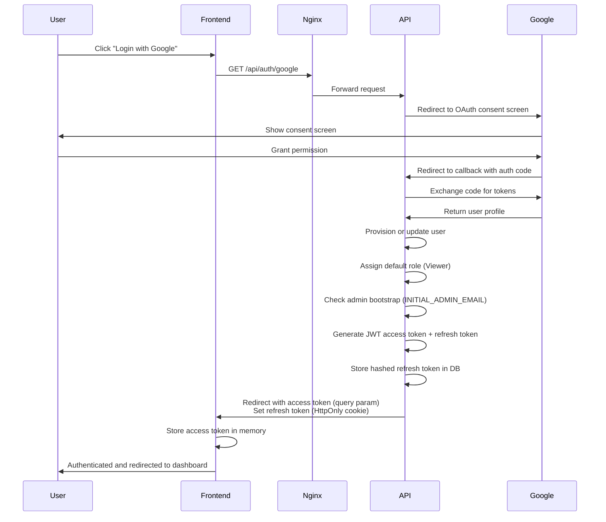
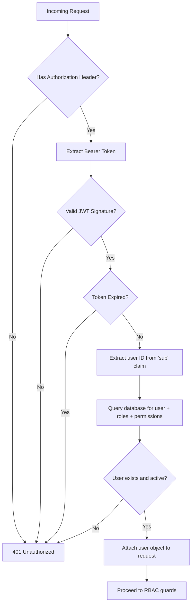
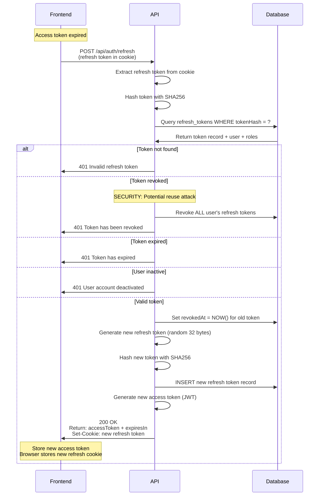
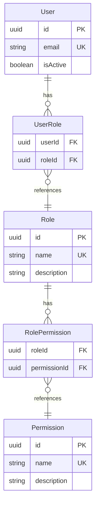
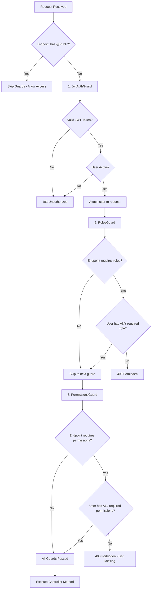
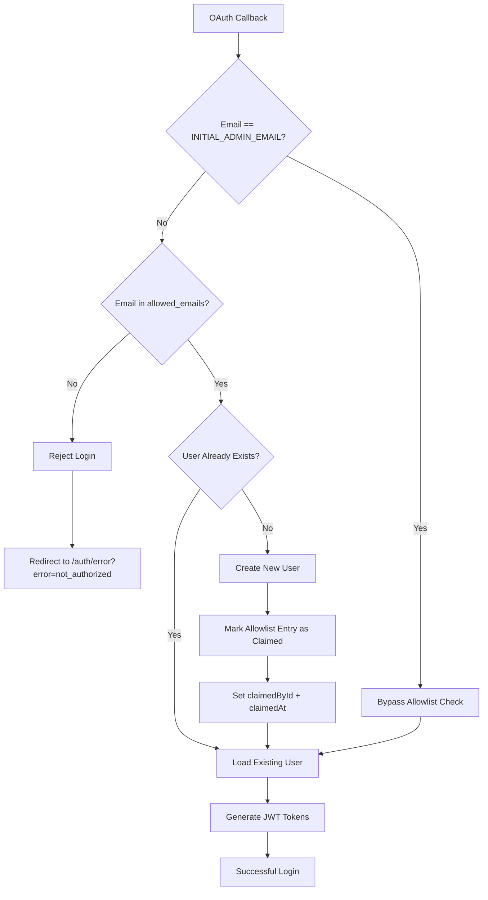
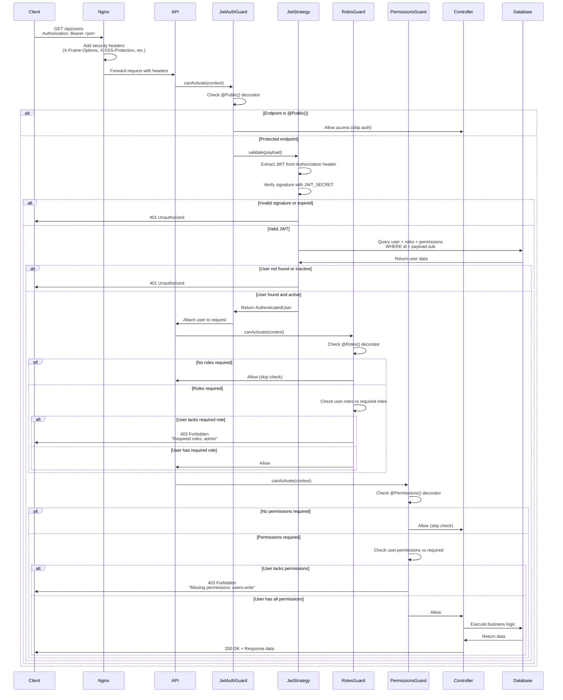
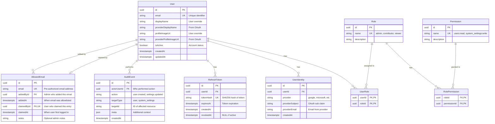

# Security Architecture

## Executive Summary

This document provides a comprehensive overview of the security architecture for OathPath. The system implements defense-in-depth security through multiple layers: OAuth 2.0 authentication with Google, JWT-based session management with token rotation, email allowlist access control, Role-Based Access Control (RBAC), and comprehensive audit logging.

**Key Security Technologies:**
- **Authentication**: OAuth 2.0 / OpenID Connect (Google)
- **Access Control**: Email allowlist restricts access to pre-authorized users
- **Session Management**: JWT access tokens + HttpOnly refresh tokens with rotation
- **Authorization**: Role-Based Access Control (RBAC) with three roles (Admin, Contributor, Viewer)
- **Token Storage**: SHA256 hashed refresh tokens in PostgreSQL
- **Infrastructure**: Nginx reverse proxy with security headers
- **Audit**: Comprehensive event logging for all security-relevant actions

**Security Posture**: Production-grade security suitable for enterprise applications handling sensitive user data.

---

## 1. Authentication Architecture

### OAuth 2.0 Flow with Google

The application uses OAuth 2.0 with OpenID Connect for authentication. All user authentication flows through Google's OAuth service, eliminating the need to store or manage passwords.



**OAuth Endpoints:**
- `GET /api/auth/google` - Initiates OAuth flow, redirects to Google
- `GET /api/auth/google/callback` - Handles OAuth callback, provisions user, returns tokens

**User Provisioning Logic:**
1. **Allowlist check**: Verify email is in `allowed_emails` table (or matches `INITIAL_ADMIN_EMAIL`)
2. If not in allowlist, reject login with "Email not authorized" error
3. Check if user identity exists (provider + subject)
4. If not, check if user exists by email (identity linking)
5. If neither, create new user with:
   - Default role: `viewer`
   - Default user settings (theme, locale)
   - Linked OAuth identity
   - Mark allowlist entry as claimed (`claimedById`, `claimedAt`)
6. Check if user email matches `INITIAL_ADMIN_EMAIL`
7. If match and no other admins exist, grant admin role
8. Update provider profile information (display name, profile image)
9. Generate JWT tokens

**Allowlist Security:**
- Only admins can add/remove emails from the allowlist
- The `INITIAL_ADMIN_EMAIL` bypasses allowlist check (bootstrap access)
- Allowlist entries that have been claimed cannot be removed (prevents accidentally removing existing user access)
- All allowlist operations are audit logged

### JWT Token Structure

**Access Token Payload:**
```json
{
  "sub": "user-uuid",
  "email": "user@example.com",
  "roles": ["viewer"],
  "iat": 1706123456,
  "exp": 1706124356
}
```

**Token Signing:**
- Algorithm: HS256 (HMAC with SHA-256)
- Secret: `JWT_SECRET` environment variable (minimum 32 characters)
- Signature validates token integrity and authenticity

**Token Validation Process:**


**Access Token Validation (JWT Strategy):**
- Verify signature using `JWT_SECRET`
- Check expiration (`exp` claim)
- Extract user ID from `sub` claim
- Load user from database with roles and permissions
- Validate user is active (`isActive = true`)
- Attach full user object to request for downstream guards

---

## 2. Token Management

### Access Tokens vs Refresh Tokens

| Aspect | Access Token | Refresh Token |
|--------|--------------|---------------|
| **Type** | JWT (signed JSON) | Random 32-byte hex string |
| **Storage (Client)** | Memory only (never localStorage) | HttpOnly cookie |
| **Storage (Server)** | None (stateless) | SHA256 hash in `refresh_tokens` table |
| **Lifetime** | 15 minutes (default) | 14 days (default) |
| **Purpose** | Authorize API requests | Obtain new access tokens |
| **Exposed to JS** | Yes (needed for Authorization header) | No (HttpOnly prevents access) |
| **Revocable** | No (stateless, valid until expiry) | Yes (database record can be revoked) |
| **Rotation** | New token on each refresh | New token on each refresh (old one revoked) |
| **Attack Surface** | XSS (if stored in localStorage) | CSRF (mitigated by SameSite) |

**Why This Design:**
- **Short-lived access tokens** minimize damage from token theft (15 min window)
- **HttpOnly cookies** protect refresh tokens from XSS attacks
- **Token rotation** limits refresh token reuse and enables reuse detection
- **Database storage** allows server-side revocation (logout, security breach)

### Token Rotation Mechanism

Refresh tokens are rotated on every use to detect token theft and limit the impact of compromised tokens.



**Rotation Benefits:**
1. **Reuse Detection**: If a revoked token is used, all tokens are invalidated (indicates theft)
2. **Limit Exposure**: Each token is single-use, limiting replay attack window
3. **Audit Trail**: Each refresh creates a database record for security monitoring

### Token Reuse Detection

The system implements refresh token reuse detection to identify potential token theft:

**Attack Scenario:**
1. Attacker steals refresh token from victim
2. Victim uses token normally (rotates to new token)
3. Attacker attempts to use old (revoked) token

**Detection & Response:**
```typescript
// Check if token is revoked
if (storedToken.revokedAt) {
  // SECURITY ALERT: Revoked token used - likely token theft
  await this.revokeAllUserTokens(storedToken.userId);
  logger.warn(`Refresh token reuse detected for user: ${userId}`);
  throw new UnauthorizedException('Refresh token has been revoked');
}
```

When a revoked token is used, the system:
1. **Revokes all refresh tokens** for that user across all devices
2. **Logs a security warning** for monitoring and alerting
3. **Forces re-authentication** on all sessions

This aggressive response ensures that if a token is stolen, the attacker's window is minimized and legitimate users are forced to re-authenticate.

### Cookie Security Settings

Refresh tokens are stored in HttpOnly cookies with strict security settings:

```typescript
const COOKIE_OPTIONS = {
  httpOnly: true,                          // Prevents JavaScript access
  secure: process.env.NODE_ENV === 'production', // HTTPS only in production
  sameSite: 'lax' as const,               // CSRF protection
  path: '/api/auth',                      // Limit scope to auth endpoints
  maxAge: 14 * 24 * 60 * 60 * 1000,      // 14 days in milliseconds
};
```

| Setting | Value | Purpose |
|---------|-------|---------|
| `httpOnly` | `true` | Prevents XSS attacks - JavaScript cannot read cookie |
| `secure` | `true` (prod) | Requires HTTPS - prevents MITM attacks |
| `sameSite` | `lax` | CSRF protection - blocks cross-site POST requests |
| `path` | `/api/auth` | Minimizes cookie scope - only sent to auth endpoints |
| `maxAge` | 14 days | Auto-expires after 14 days |

**SameSite Policy Explanation:**
- `lax`: Cookie sent on same-site requests and top-level navigation (safe GET)
- Blocks cookie on cross-site POST/PUT/DELETE (prevents CSRF on token refresh)
- Allows OAuth redirect callbacks (same-site navigation)

### Token Cleanup Task

Expired and revoked refresh tokens are automatically cleaned up to reduce database size:

```typescript
@Cron(CronExpression.EVERY_DAY_AT_3AM)
async handleCron() {
  const count = await this.authService.cleanupExpiredTokens();
  logger.log(`Token cleanup: ${count} tokens removed`);
}
```

**Cleanup Logic:**
- Runs daily at 3:00 AM
- Deletes tokens where:
  - `expiresAt < NOW()` (expired)
  - `revokedAt IS NOT NULL` (revoked)
- Removes sensitive data from database
- Improves query performance

---

## 3. Authorization & RBAC

### Roles and Permissions Model

The system implements a flexible Role-Based Access Control (RBAC) model with three predefined roles:



### Permissions Matrix

| Permission | Description | Admin | Contributor | Viewer |
|------------|-------------|-------|-------------|--------|
| `system_settings:read` | View system-wide settings | ✅ | ❌ | ❌ |
| `system_settings:write` | Modify system-wide settings | ✅ | ❌ | ❌ |
| `users:read` | View user list and details | ✅ | ❌ | ❌ |
| `users:write` | Modify user accounts (activate/deactivate, assign roles) | ✅ | ❌ | ❌ |
| `rbac:manage` | Assign roles to users | ✅ | ❌ | ❌ |
| `allowlist:read` | View allowlisted email addresses | ✅ | ❌ | ❌ |
| `allowlist:write` | Add/remove emails from allowlist | ✅ | ❌ | ❌ |
| `user_settings:read` | View own user settings | ✅ | ✅ | ✅ |
| `user_settings:write` | Modify own user settings | ✅ | ✅ | ✅ |

**Role Descriptions:**
- **Admin**: Full system access - manage users, roles, and all settings
- **Contributor**: Standard user capabilities - manage own settings (ready for future feature expansion)
- **Viewer**: Read-only access - minimal privileges, manage own settings (default role for new users)

**Default Role Assignment:**
- New users are assigned the `viewer` role automatically
- First user matching `INITIAL_ADMIN_EMAIL` receives `admin` role (bootstrap)
- Additional roles can be assigned by admins via `/api/users/{id}` endpoint

### Guard Execution Flow

The authorization system uses three guards that execute in sequence:



**Guard Logic:**

1. **JwtAuthGuard** (Global, Required by default)
   - Checks for `@Public()` decorator - if present, skip all auth
   - Validates JWT token from `Authorization: Bearer <token>` header
   - Loads user with roles and permissions from database
   - Verifies user is active
   - Attaches `AuthenticatedUser` object to `request.user`

2. **RolesGuard** (OR Logic)
   - Checks for `@Roles()` decorator - if absent, allow access
   - Extracts required roles from decorator metadata
   - Checks if user has **ANY** of the required roles
   - Returns 403 if user lacks all required roles
   - Example: `@Roles('admin', 'contributor')` - user needs admin OR contributor

3. **PermissionsGuard** (AND Logic)
   - Checks for `@Permissions()` decorator - if absent, allow access
   - Extracts required permissions from decorator metadata
   - Checks if user has **ALL** required permissions
   - Returns 403 with list of missing permissions if check fails
   - Example: `@Permissions('users:read', 'users:write')` - user needs BOTH

**Why OR for Roles but AND for Permissions?**
- **Roles** are broad categories - "any admin or contributor can access"
- **Permissions** are specific capabilities - "needs both read AND write"
- This provides flexibility: `@Auth({ roles: ['admin'], permissions: ['system_settings:write'] })`

### Using Authorization Decorators

**Combined `@Auth()` Decorator (Recommended):**
```typescript
import { Auth } from './auth/decorators';
import { ROLES, PERMISSIONS } from './common/constants/roles.constants';

// Just authentication, no role/permission requirements
@Auth()
@Get('profile')
async getProfile(@CurrentUser() user: RequestUser) { }

// Require admin role
@Auth({ roles: [ROLES.ADMIN] })
@Get('users')
async listUsers() { }

// Require specific permissions
@Auth({ permissions: [PERMISSIONS.SYSTEM_SETTINGS_WRITE] })
@Patch('system-settings')
async updateSystemSettings() { }

// Combine roles and permissions
@Auth({
  roles: [ROLES.ADMIN],
  permissions: [PERMISSIONS.USERS_WRITE]
})
@Patch('users/:id')
async updateUser() { }
```

**Individual Decorators:**
```typescript
import { UseGuards } from '@nestjs/common';
import { JwtAuthGuard, RolesGuard } from './auth/guards';
import { Roles } from './auth/decorators';

@UseGuards(JwtAuthGuard, RolesGuard)
@Roles('admin', 'contributor')
@Get('dashboard')
async getDashboard() { }
```

**Public Endpoints:**
```typescript
import { Public } from './auth/decorators';

@Public()
@Get('auth/providers')
async getProviders() {
  // No authentication required
}
```

---

## 4. Email Allowlist Access Control

### Overview

The application implements an **email allowlist** as an additional security layer to restrict access to pre-authorized users only. This feature prevents unauthorized users from gaining access even if they successfully authenticate via OAuth.

**Security Benefits:**
- Prevents open registration - only invited users can access the application
- Provides administrative control over who can login
- Tracks when allowlist entries are claimed (first login)
- Prevents accidental removal of access for existing users

### Allowlist Enforcement Flow



### Allowlist Table Schema

```typescript
model AllowedEmail {
  id          String    @id @default(uuid())
  email       String    @unique              // Pre-authorized email
  addedById   String?                        // Admin who added this
  addedAt     DateTime  @default(now())      // When it was allowlisted
  claimedById String?   @unique              // User who claimed it
  claimedAt   DateTime?                      // When user first logged in
  notes       String?                        // Optional admin notes
}
```

**Key Fields:**
- `email` - Unique constraint ensures no duplicates
- `claimedById` - Unique constraint (one user per allowlist entry)
- `claimedAt` - Null = pending, populated = claimed

### Status Types

| Status | Description | claimedById | claimedAt |
|--------|-------------|-------------|-----------|
| **Pending** | Email added but user hasn't logged in yet | `null` | `null` |
| **Claimed** | User has successfully logged in | User ID | Timestamp |

### Admin Operations

#### Add Email to Allowlist

**Endpoint:** `POST /api/allowlist`

**Permission Required:** `allowlist:write` (Admin only)

**Request:**
```json
{
  "email": "newuser@example.com",
  "notes": "New team member starting next week"
}
```

**Business Logic:**
1. Validate email format
2. Check for duplicates (return 409 if exists)
3. Create allowlist entry with `addedById` = current admin
4. Audit log the addition

**Use Case:** Admins pre-authorize users before they attempt their first login.

---

#### Remove Email from Allowlist

**Endpoint:** `DELETE /api/allowlist/:id`

**Permission Required:** `allowlist:write` (Admin only)

**Validation:**
- ✅ Can remove if `claimedById` is `null` (pending entry)
- ❌ Cannot remove if `claimedById` is populated (claimed entry)

**Rationale:** Prevents admins from accidentally removing access for existing users. To revoke access for existing users, use the user deactivation feature instead (`PATCH /api/users/:id` with `isActive: false`).

**Business Logic:**
1. Check if entry is claimed
2. If claimed, return 400 Bad Request with error message
3. If pending, delete entry
4. Audit log the removal

---

#### List Allowlist Entries

**Endpoint:** `GET /api/allowlist`

**Permission Required:** `allowlist:read` (Admin only)

**Query Parameters:**
- `status` - Filter by: `all`, `pending`, `claimed`
- `search` - Search by email
- `sortBy` - Sort by: `email`, `addedAt`, `claimedAt`
- `sortOrder` - Order: `asc`, `desc`

**Response Includes:**
- Email address
- Status (pending/claimed)
- Admin who added it
- When it was added
- User who claimed it (if claimed)
- When it was claimed (if claimed)
- Optional notes

### Bootstrap Admin Bypass

The `INITIAL_ADMIN_EMAIL` environment variable provides a special bypass to enable the first admin to login without being pre-added to the allowlist.

**Bootstrap Logic:**
```typescript
async validateOAuthUser(profile: OAuthProfile) {
  const email = profile.email;

  // Special case: initial admin bypasses allowlist
  if (email === process.env.INITIAL_ADMIN_EMAIL) {
    // Allow login without allowlist check
    return this.provisionUser(profile);
  }

  // Check allowlist for all other users
  const allowlistEntry = await this.allowlistService.findByEmail(email);
  if (!allowlistEntry) {
    throw new UnauthorizedException('Email not authorized');
  }

  return this.provisionUser(profile);
}
```

**Why This is Secure:**
- The admin must have access to the `.env` file (server access)
- Only one email bypasses the check
- After initial admin logs in, they can add other users to the allowlist
- The initial admin email is automatically added to the allowlist during database seeding

### Integration with User Provisioning

When a user with a allowlisted email successfully authenticates:

1. **Check allowlist** before user provisioning
2. **Create user** if they don't exist
3. **Mark entry as claimed** by setting:
   - `claimedById` = new user's ID
   - `claimedAt` = current timestamp
4. **Update is idempotent** - if user logs in again, allowlist entry remains claimed

### Audit Trail

All allowlist operations are logged to the `audit_events` table:

| Action | Actor | Target | Description |
|--------|-------|--------|-------------|
| `allowlist.added` | Admin User ID | Allowlist Entry ID | Admin added email to allowlist |
| `allowlist.removed` | Admin User ID | Allowlist Entry ID | Admin removed pending entry |
| `allowlist.claimed` | User ID | Allowlist Entry ID | User claimed allowlist entry on first login |

### Security Considerations

**Protection Against:**
- ✅ Unauthorized access - Only allowlisted emails can login
- ✅ Open registration - No public signup, invitation-only
- ✅ Accidental removal - Cannot delete claimed entries

**Edge Cases Handled:**
- Email case-insensitivity (normalized to lowercase)
- Duplicate email prevention (unique constraint)
- Race condition on claim (unique constraint on claimedById)
- Orphaned allowlist entries (admin can clean up pending entries)

**Best Practices:**
- Add users to allowlist before sharing OAuth link
- Use notes field to track why user was allowlisted
- Regularly audit claimed vs pending entries
- Use user deactivation (`isActive: false`) instead of allowlist removal for revoking access

---

## 5. Request Lifecycle

### End-to-End Protected Request Flow

This diagram shows the complete security lifecycle of a protected API request:



**Security Checkpoints:**
1. **Nginx Layer**: Security headers, rate limiting (if configured)
2. **JWT Validation**: Signature, expiration, user exists and active
3. **Role Check**: User has required role (if specified)
4. **Permission Check**: User has all required permissions (if specified)
5. **Business Logic**: Controller executes with verified user context

**Request Object After Guards:**
```typescript
interface FastifyRequest {
  user: AuthenticatedUser;  // Full user object with relations
  requestUser: RequestUser; // Simplified user object
}

interface AuthenticatedUser {
  id: string;
  email: string;
  isActive: boolean;
  userRoles: Array<{
    role: {
      name: string;
      rolePermissions: Array<{
        permission: { name: string; }
      }>;
    };
  }>;
}

interface RequestUser {
  id: string;
  email: string;
  roles: string[];        // ['admin', 'viewer']
  permissions: string[];  // ['users:read', 'users:write', ...]
}
```

---

## 6. Database Security Model

### Security Tables ERD



**Table Descriptions:**

| Table | Purpose | Security Features |
|-------|---------|-------------------|
| `users` | Core user accounts | `isActive` flag for soft deletion, prevents auth |
| `user_identities` | OAuth provider links | `provider + providerSubject` unique constraint |
| `roles` | Role definitions | Seeded at deployment, rarely modified |
| `permissions` | Permission definitions | Seeded at deployment, rarely modified |
| `role_permissions` | Role-to-permission mapping | Defines RBAC matrix |
| `user_roles` | User role assignments | Modified by admins via API, cascade delete |
| `refresh_tokens` | Active refresh tokens | SHA256 hashed, includes revocation timestamp |
| `allowed_emails` | Email allowlist | Restricts access, tracks claim status, prevents removal if claimed |
| `audit_events` | Security audit log | Immutable log of all security events |

### Audit Logging

The `audit_events` table provides a comprehensive audit trail for compliance and security monitoring.

**Audited Events:**
- User account creation
- User role assignments/changes
- User activation/deactivation
- System settings modifications
- User settings modifications
- Allowlist email additions/removals
- Allowlist entry claims (when user first logs in)
- Authentication events (login, logout, token refresh)

**Audit Event Structure:**
```typescript
interface AuditEvent {
  id: string;
  actorUserId: string | null;  // null for system actions
  action: string;               // e.g., 'user.role_assigned'
  targetType: string;           // e.g., 'user', 'system_settings'
  targetId: string;             // ID of affected resource
  meta: Record<string, any>;    // Additional context (changes, IP, etc.)
  createdAt: Date;
}
```

**Example Audit Entries:**
```json
[
  {
    "action": "user.created",
    "actorUserId": null,
    "targetType": "user",
    "targetId": "uuid-123",
    "meta": {
      "email": "user@example.com",
      "provider": "google",
      "initialRole": "viewer"
    }
  },
  {
    "action": "user.role_assigned",
    "actorUserId": "admin-uuid",
    "targetType": "user",
    "targetId": "user-uuid",
    "meta": {
      "role": "admin",
      "previousRoles": ["viewer"]
    }
  }
]
```

**Indexed Fields** (for query performance):
- `actorUserId` - Find all actions by a user
- `targetType + targetId` - Find all events for a resource
- `createdAt` - Time-based queries and retention policies

---

## 7. File Storage Security

The storage system implements multiple layers of security to protect uploaded files and prevent unauthorized access.

### Upload Validation

All file uploads are validated before acceptance:

**MIME Type Validation:**
- Configurable allowlist of permitted file types
- Default: Common document and image formats
- Server-side validation (client-declared MIME type verified)
- Prevents upload of executable files and scripts

**File Size Limits:**
- Configurable maximum file size (default: 10GB)
- Enforced at both simple upload and multipart initialization
- Prevents storage abuse and DoS attacks
- Size validation before S3 upload begins

**Content Type Verification:**
- Validates that file content matches declared MIME type
- Uses magic number detection for common file types
- Prevents MIME type spoofing attacks

**Example Configuration:**
```typescript
STORAGE_MAX_FILE_SIZE=10737418240      // 10GB in bytes
STORAGE_ALLOWED_MIME_TYPES=application/pdf,image/jpeg,image/png,application/zip
```

### Access Control

Storage access is **ownership-based**, checked in the service layer, with a
single deliberate exception: **delete honours `storage:delete_any`**.

`ObjectsController` (`apps/api/src/storage/objects/objects.controller.ts`) is
decorated `@Auth()` with **no `permissions`**, so no route guard gates any
storage route on a `storage:*` string. That is intentional rather than an
oversight: every authenticated user may act on their own objects, so a
`PermissionsGuard` on these routes would reject the ordinary case.
Authorization is a per-object decision, and it is made in
`objects.service.ts`.

**Owner-Only Access (read and write):**
- `getById`, `getDownloadUrl`, `updateMetadata` and the upload lifecycle
  (`getUploadStatus`, `completeUpload`, `abortUpload`) run an ownership check
  and nothing else — `getObjectWithAuthCheck`, plus the equivalent inline
  checks in the upload methods: `if (object.uploadedById !== userId) throw new
  ForbiddenException(...)`.
- There is **no admin bypass on these paths.** A user who is not the uploader
  is forbidden, full stop — including an Admin holding `storage:delete_any`.
  That permission is scoped to deletion by its name and by its implementation;
  see "Why delete has its own path" below.

**The delete override (`storage:delete_any`):**
- A caller holding `storage:delete_any` may delete an object they did not
  upload. Admin is the only seeded role that holds it
  (`apps/api/prisma/seed.ts`). This exists so an abusive upload, a departed
  user's files, or a GDPR erasure request can be handled through the API
  rather than only through direct database and object-store access.
- The controller resolves the caller's permissions to a single capability and
  passes it down; the service makes the decision, because only it knows the
  object's owner. There is one check, not one per layer.
- **A cross-user delete is audited distinctly.** `delete()` has always written
  a `storage:object:delete` row to `audit_events`; when the override is what
  admitted the call, that row's `meta` additionally carries `ownerUserId` (the
  uploader) and `overridePermission` (`storage:delete_any`), alongside the
  `actorUserId` that names the deleter. A self-delete writes exactly the meta
  it always did and never claims an override.
- **The override does not change 404 behaviour.** Existence is resolved before
  ownership, so an absent id is a 404 for holder and non-holder alike and the
  permission is not an existence oracle.

**Permission Model:**
| Permission | Description | Granted To (role seed) | Enforced? |
|------------|-------------|------------|------------|
| `storage:read` | Read object metadata, get download URLs | Admin, Contributor, Viewer | **No** — ownership governs reads |
| `storage:write` | Upload, update metadata | Admin, Contributor | **No** — ownership governs writes, and any authenticated user can upload |
| `storage:delete_any` | Admin: delete any object | Admin | **Yes** — `ObjectsService.delete` |

`storage:read` and `storage:write` remain **defined, seeded, and read by
nothing.** A Viewer can upload today, because no check consults
`storage:write`. Whether those two should gate their routes or be removed is
deliberately still open (issue #199); only the delete override was decided.

These are the only three storage permission strings that exist
(`apps/api/src/common/constants/roles.constants.ts`). `storage:delete`,
`storage:read_any`, and `storage:write_any` are not defined anywhere in the
codebase.

**Ownership Validation — What The Code Actually Does:**
```typescript
// apps/api/src/storage/objects/objects.service.ts
// Backs every read and write path. No permission is consulted here.
private async getObjectWithAuthCheck(
  id: string,
  userId: string,
): Promise<any> {
  const object = await this.prisma.storageObject.findUnique({
    where: { id },
  });

  if (!object) {
    throw new NotFoundException('Object not found');
  }

  // Check ownership
  if (object.uploadedById !== userId) {
    throw new ForbiddenException('You do not have access to this object');
  }

  return object;
}
```

**Why delete has its own path:**
```typescript
// apps/api/src/storage/objects/objects.service.ts
// Used by delete() alone. `canDeleteAny` is the caller's storage:delete_any.
private async getObjectForDelete(
  id: string,
  userId: string,
  canDeleteAny: boolean,
): Promise<any> {
  const object = await this.prisma.storageObject.findUnique({
    where: { id },
  });

  if (!object) {
    throw new NotFoundException('Object not found');
  }

  if (object.uploadedById !== userId && !canDeleteAny) {
    throw new ForbiddenException('You do not have access to this object');
  }

  return object;
}
```
The duplication is the point. `getObjectWithAuthCheck` is shared by every read
and write path, so threading a permission argument through it would turn
`storage:delete_any` into a read *and* write bypass in a single edit — a
holder could suddenly read, download and modify other users' objects, which
the permission's name does not promise. Keeping the two resolvers separate
means widening the override has to be a deliberate change to this code rather
than a side effect of touching shared code. Integration tests assert an Admin
still receives 403 on GET, download, and PATCH-metadata for another user's
object.

### Signed URLs

The storage system uses time-limited presigned URLs for secure file access:

**Download URLs:**
- Generated via S3 presigned GET URLs
- Default expiration: 1 hour (3600 seconds)
- Configurable per-request via `expiresIn` parameter
- URLs cannot be reused after expiration
- No AWS credentials exposed to client

**Upload URLs (Multipart):**
- Generated via S3 presigned PUT URLs for each part
- Short expiration: 15 minutes per part
- One-time use: URL invalidated after part upload
- Direct-to-S3 upload (bypasses application server for performance)

**Security Properties:**
- URLs cryptographically signed by AWS credentials
- Tampering detected via signature validation
- Time-based expiration prevents long-lived access
- Scoped to specific S3 operation (GET or PUT)

**Example Presigned URL Generation:**
```typescript
async generateDownloadUrl(objectId: string, expiresIn = 3600): Promise<string> {
  const object = await this.findById(objectId);

  return this.storageProvider.getSignedDownloadUrl(
    object.storageKey,
    expiresIn,
  );
}
```

### S3 Security Configuration

**Recommended S3 Bucket Security Settings:**

**IAM Roles (Production):**
- Use EC2/ECS IAM roles instead of static credentials
- Principle of least privilege: grant only required S3 permissions
- Rotate credentials if using access keys

**Server-Side Encryption:**
```typescript
// Enable SSE-S3 (AWS-managed keys)
ServerSideEncryption: 'AES256'

// Or SSE-KMS (customer-managed keys)
ServerSideEncryption: 'aws:kms'
KMSKeyId: 'arn:aws:kms:region:account:key/key-id'
```

**Block Public Access:**
```json
{
  "BlockPublicAcls": true,
  "IgnorePublicAcls": true,
  "BlockPublicPolicy": true,
  "RestrictPublicBuckets": true
}
```

**Access Logging:**
- Enable S3 access logs for audit trail
- Log bucket: separate from application bucket
- Review logs for suspicious access patterns

**Versioning:**
- Enable versioning for accidental deletion protection
- Configure lifecycle policy to archive old versions

**CORS Configuration:**
```json
{
  "CORSRules": [
    {
      "AllowedOrigins": ["https://yourdomain.com"],
      "AllowedMethods": ["PUT"],
      "AllowedHeaders": ["*"],
      "MaxAgeSeconds": 3000
    }
  ]
}
```

**Bucket Policy Example:**
```json
{
  "Version": "2012-10-17",
  "Statement": [
    {
      "Effect": "Deny",
      "Principal": "*",
      "Action": "s3:*",
      "Resource": "arn:aws:s3:::bucket-name/*",
      "Condition": {
        "Bool": { "aws:SecureTransport": "false" }
      }
    }
  ]
}
```

### Audit Logging

All storage operations are logged to the `audit_events` table for security monitoring and compliance:

**Logged Events:**

| Event | Action | Description |
|-------|--------|-------------|
| Upload Started | `storage:upload:init` | Multipart upload initialized |
| Upload Completed | `storage:upload:complete` | File upload finalized successfully |
| Upload Aborted | `storage:upload:abort` | Upload cancelled by user or system |
| Object Downloaded | `storage:object:download` | Download URL generated |
| Object Deleted | `storage:object:delete` | Object and file removed |
| Metadata Updated | `storage:object:metadata:update` | Custom metadata modified |

**Audit Event Structure:**
```typescript
{
  actorUserId: 'user-uuid',
  action: 'storage:upload:complete',
  targetType: 'storage_object',
  targetId: 'object-uuid',
  meta: {
    objectName: 'document.pdf',
    size: 1048576,
    mimeType: 'application/pdf',
    storageProvider: 's3',
    ipAddress: '192.168.1.1',
    userAgent: 'Mozilla/5.0...'
  },
  createdAt: '2024-01-01T12:00:00Z'
}
```

**Monitoring Queries:**
```sql
-- Large file uploads
SELECT * FROM audit_events
WHERE action = 'storage:upload:complete'
  AND (meta->>'size')::bigint > 1073741824  -- 1GB
ORDER BY created_at DESC;

-- Suspicious deletion patterns
SELECT actor_user_id, COUNT(*) as delete_count
FROM audit_events
WHERE action = 'storage:object:delete'
  AND created_at > NOW() - INTERVAL '1 hour'
GROUP BY actor_user_id
HAVING COUNT(*) > 10;
```

### Security Best Practices

**Do's:**
- ✅ Use IAM roles instead of access keys in production
- ✅ Enable S3 server-side encryption
- ✅ Set short expiration times on presigned URLs
- ✅ Validate file types server-side (never trust client)
- ✅ Enforce file size limits to prevent abuse
- ✅ Monitor audit logs for suspicious patterns
- ✅ Block public access on S3 buckets
- ✅ Use HTTPS for all S3 operations
- ✅ Implement virus scanning for user uploads (recommended)

**Don'ts:**
- ❌ Never commit AWS credentials to source control
- ❌ Never allow unrestricted file uploads
- ❌ Never rely on client-side MIME type validation
- ❌ Never use long-lived presigned URLs (> 1 hour)
- ❌ Never skip ownership validation on operations
- ❌ Never expose S3 bucket names in error messages
- ❌ Never allow executable file uploads (.exe, .sh, .bat)

---

## 8. Infrastructure Security

### Nginx Security Headers

The Nginx reverse proxy applies security headers to all responses:

```nginx
# Security headers
add_header X-Frame-Options "SAMEORIGIN" always;
add_header X-Content-Type-Options "nosniff" always;
add_header X-XSS-Protection "1; mode=block" always;
add_header Referrer-Policy "strict-origin-when-cross-origin" always;
```

| Header | Value | Purpose |
|--------|-------|---------|
| `X-Frame-Options` | `SAMEORIGIN` | Prevents clickjacking - only allow framing from same origin |
| `X-Content-Type-Options` | `nosniff` | Prevents MIME sniffing - force declared content type |
| `X-XSS-Protection` | `1; mode=block` | Legacy XSS protection for older browsers |
| `Referrer-Policy` | `strict-origin-when-cross-origin` | Limit referrer info sent to external sites |

**Additional Headers (Recommended for Production):**
```nginx
# Add these for enhanced security
add_header Strict-Transport-Security "max-age=31536000; includeSubDomains" always;  # HTTPS only
add_header Content-Security-Policy "default-src 'self'; script-src 'self' 'unsafe-inline'; style-src 'self' 'unsafe-inline';" always;
add_header Permissions-Policy "geolocation=(), microphone=(), camera=()" always;
```

### CORS Configuration

The application uses same-origin architecture (frontend and API served from same host via Nginx), so CORS is disabled by default:

- Frontend: `http://localhost:3535/`
- API: `http://localhost:3535/api`
- API reference: `http://localhost:3535/api/docs`

**Benefits of Same-Origin:**
- No CORS configuration needed
- Cookies work without `withCredentials`
- Simplified security model
- No preflight requests

**If CORS is Needed (e.g., mobile app, separate domains):**
```typescript
// In main.ts
app.enableCors({
  origin: process.env.ALLOWED_ORIGINS?.split(',') || 'http://localhost:3000',
  credentials: true,  // Allow cookies
  methods: ['GET', 'POST', 'PUT', 'PATCH', 'DELETE', 'OPTIONS'],
  allowedHeaders: ['Authorization', 'Content-Type'],
});
```

### Environment Secrets

**Critical Secrets (Must Protect):**

| Variable | Purpose | Security Requirement |
|----------|---------|---------------------|
| `JWT_SECRET` | Signs JWT tokens | Min 32 chars, random, never commit |
| `COOKIE_SECRET` | Signs session cookies | Min 32 chars, random, never commit |
| `GOOGLE_CLIENT_SECRET` | OAuth with Google | From Google Console, never commit |
| `DATABASE_URL` | Database connection | Contains credentials, never commit |
| `POSTGRES_PASSWORD` | Database password | Strong password, never commit |

**Generate Secrets:**
```bash
# Generate strong secrets (32+ characters)
openssl rand -base64 32

# Or use Node.js
node -e "console.log(require('crypto').randomBytes(32).toString('base64'))"
```

**Environment File Security:**
```bash
# Never commit .env files
echo ".env" >> .gitignore
echo ".env.local" >> .gitignore
echo ".env.*.local" >> .gitignore

# Use .env.example for template (no real values)
cp .env.example .env
# Then fill in real values
```

**Production Secret Management:**
- Use secret management services (AWS Secrets Manager, Azure Key Vault, HashiCorp Vault)
- Inject secrets as environment variables at runtime
- Rotate secrets regularly (JWT_SECRET, GOOGLE_CLIENT_SECRET)
- Use different secrets per environment (dev, staging, prod)

---

## 9. Attack Mitigation Matrix

| Attack Vector | Mitigation Strategy | Implementation |
|--------------|---------------------|----------------|
| **SQL Injection** | Parameterized queries | Prisma ORM (prepared statements by default) |
| **XSS (Cross-Site Scripting)** | Output encoding, CSP headers | React automatic escaping, `X-XSS-Protection` header |
| **CSRF (Cross-Site Request Forgery)** | SameSite cookies, same-origin | `SameSite=lax` on refresh token cookie |
| **Token Theft (XSS)** | HttpOnly cookies for refresh tokens | Access token in memory only, refresh in HttpOnly cookie |
| **Token Theft (MITM)** | HTTPS only, Secure cookies | `secure: true` in production, HSTS header |
| **Brute Force (Password)** | No passwords (OAuth only) | Google OAuth, no password storage |
| **Session Hijacking** | Short-lived tokens, rotation | 15-min access tokens, refresh rotation on use |
| **Token Reuse Attack** | Reuse detection, revoke all | Revoke all user tokens when revoked token used |
| **Privilege Escalation** | RBAC enforcement, server-side validation | Roles/Permissions guards, database-driven RBAC |
| **Account Enumeration** | Generic error messages | "Invalid credentials" for all auth failures |
| **Clickjacking** | Frame-busting headers | `X-Frame-Options: SAMEORIGIN` |
| **MIME Sniffing** | Content-Type enforcement | `X-Content-Type-Options: nosniff` |
| **Insecure Direct Object Reference** | Authorization checks | Guards verify user permissions before data access |
| **Mass Assignment** | DTO validation | Class-validator on all DTOs, whitelist only |
| **Information Disclosure** | Generic errors, no stack traces | Production error handler, sanitized responses |
| **Denial of Service** | Rate limiting (recommended) | Can add rate limiter to Nginx or NestJS |

**Not Yet Implemented (Consider for Production):**
- **Rate Limiting**: Add `@nestjs/throttler` or Nginx rate limiting
- **Input Validation**: Add class-validator decorators to all DTOs
- **API Key Rotation**: Rotate Google OAuth credentials periodically
- **Anomaly Detection**: Monitor audit logs for suspicious patterns
- **IP Allowlisting**: Restrict admin endpoints to known IPs

---

## 10. Configuration Reference

### Environment Variables

**Authentication & JWT:**
```bash
# JWT Configuration
JWT_SECRET=your-super-secret-key-min-32-characters-long
JWT_ACCESS_TTL_MINUTES=15          # Access token lifetime (default: 15 minutes)
JWT_REFRESH_TTL_DAYS=14            # Refresh token lifetime (default: 14 days)

# Cookie Configuration
COOKIE_SECRET=your-cookie-secret-key-min-32-characters-long
```

**Credential Encryption:**
```bash
# Base64-encoded 32-byte AES-256 key. Encrypts secrets an administrator
# configures at runtime (e.g. an SMTP password) before they are stored in the
# `credentials` table. Does NOT apply to deploy-time secrets such as
# JWT_SECRET or GOOGLE_CLIENT_SECRET, which stay in the environment.
# Optional until a credential is stored; see section 14 below.
# Generate with: openssl rand -base64 32
SECRETS_ENCRYPTION_KEY=
```

**OAuth Providers:**
```bash
# Google OAuth (Required)
GOOGLE_CLIENT_ID=your-google-client-id.apps.googleusercontent.com
GOOGLE_CLIENT_SECRET=your-google-client-secret
GOOGLE_CALLBACK_URL=http://localhost:3535/api/auth/google/callback

# Microsoft OAuth (Optional)
MICROSOFT_CLIENT_ID=your-microsoft-client-id
MICROSOFT_CLIENT_SECRET=your-microsoft-client-secret
MICROSOFT_CALLBACK_URL=http://localhost:3535/api/auth/microsoft/callback
```

**Database:**
```bash
DATABASE_URL=postgresql://postgres:postgres@db:5432/oathpath
POSTGRES_USER=postgres
POSTGRES_PASSWORD=your-strong-password-here
POSTGRES_DB=oathpath
```

**Admin Bootstrap:**
```bash
# First user with this email becomes admin
INITIAL_ADMIN_EMAIL=admin@example.com
```

**Application:**
```bash
NODE_ENV=development              # development | production
PORT=3000                         # API server port
APP_URL=http://localhost:3535     # Base URL (for OAuth redirects)
```

### Recommended Security Settings

**Development:**
```bash
JWT_ACCESS_TTL_MINUTES=60         # Longer for convenience
JWT_REFRESH_TTL_DAYS=14
NODE_ENV=development
```

**Production:**
```bash
JWT_ACCESS_TTL_MINUTES=15         # Short-lived for security
JWT_REFRESH_TTL_DAYS=7            # Shorter refresh window
NODE_ENV=production
APP_URL=https://yourdomain.com    # HTTPS required
```

**High-Security Environment:**
```bash
JWT_ACCESS_TTL_MINUTES=5          # Very short access tokens
JWT_REFRESH_TTL_DAYS=1            # Require daily re-authentication
NODE_ENV=production
```

---

## 11. Implementation Notes: Fastify + Passport OAuth

### Challenge: OAuth Strategy Compatibility

This application uses NestJS with **Fastify adapter** instead of Express. Passport OAuth strategies (like `passport-google-oauth20`) are designed for Express and expect Express-style request/response objects, which creates a compatibility challenge.

### The Problem

Passport OAuth strategies perform these operations:
1. Redirect user to OAuth provider (Google)
2. Handle callback from provider
3. Extract user profile from provider response
4. Attach user object to request

Passport expects to work with Node.js `http.IncomingMessage` and `http.ServerResponse` objects directly, but Fastify wraps these in its own `FastifyRequest` and `FastifyReply` objects with different APIs.

**Key Differences:**
- Express/Node.js: `res.status(200).json(data)`, `res.redirect(url)`
- Fastify: `res.code(200).send(data)`, `res.redirect(url)`

### The Solution: Custom OAuth Guard

The `GoogleOAuthGuard` uses NestJS's execution context to provide Passport with the raw Node.js objects it expects, then copies the authenticated user back to the Fastify request.

**Implementation (`apps/api/src/auth/guards/google-oauth.guard.ts`):**

```typescript
import { ExecutionContext, Injectable } from '@nestjs/common';
import { AuthGuard } from '@nestjs/passport';

@Injectable()
export class GoogleOAuthGuard extends AuthGuard('google') {
  // Provide raw Node.js request to Passport
  getRequest(context: ExecutionContext) {
    const request = context.switchToHttp().getRequest();
    return request.raw || request;  // request.raw is the underlying http.IncomingMessage
  }

  // Provide raw Node.js response to Passport
  getResponse(context: ExecutionContext) {
    const response = context.switchToHttp().getResponse();
    return response.raw || response;  // response.raw is the underlying http.ServerResponse
  }

  // After Passport authentication, copy user to Fastify request
  handleRequest<TUser = unknown>(
    err: Error | null,
    user: TUser | false,
    _info: unknown,
    context: ExecutionContext,
  ): TUser {
    if (err || !user) {
      throw err || new Error('Authentication failed');
    }

    // Copy user from raw request to Fastify request
    // so controllers can access req.user normally
    const fastifyRequest = context.switchToHttp().getRequest();
    fastifyRequest.user = user;

    return user;
  }
}
```

**How It Works:**

1. **`getRequest()`**: Returns `request.raw` - the underlying Node.js `IncomingMessage` object that Passport can work with
2. **`getResponse()`**: Returns `response.raw` - the underlying Node.js `ServerResponse` object
3. **OAuth Flow**: Passport performs the OAuth redirect and callback using these raw objects
4. **`handleRequest()`**: After successful authentication, copies the user profile from the raw request to the Fastify request object
5. **Controller Access**: Controllers can now access `req.user` as if using Express

**Controller Usage:**

```typescript
@Get('google/callback')
@Public()
@UseGuards(GoogleOAuthGuard)
async googleAuthCallback(
  @Req() req: FastifyRequest & { user?: GoogleProfile },
  @Res() res: FastifyReply,
) {
  // Guard has populated req.user with the Google profile
  const profile = req.user;

  // Process authentication...
  const tokens = await this.authService.handleGoogleLogin(profile);

  // Use Fastify methods for response
  return res.redirect(302, redirectUrl.toString());
}
```

### Error Handling in OAuth Callbacks

When OAuth callbacks fail, error messages must be safely embedded in redirect URLs.

**Challenge:** Error messages may contain newlines, special characters, or exceed URL length limits.

**Solution:** Sanitize error messages before adding to URL:

```typescript
try {
  // OAuth authentication logic...
} catch (error) {
  this.logger.error('Error in Google OAuth callback', error);
  const appUrl = this.configService.get<string>('appUrl');

  // Sanitize: remove newlines, URL encode, limit length
  const errorMessage = error instanceof Error
    ? encodeURIComponent(error.message.replace(/[\r\n]/g, ' ').substring(0, 100))
    : 'authentication_failed';

  return res.redirect(`${appUrl}/auth/callback?error=${errorMessage}`);
}
```

**Sanitization Steps:**
1. Extract error message safely (check `instanceof Error`)
2. Replace newlines with spaces: `replace(/[\r\n]/g, ' ')`
3. Limit length: `substring(0, 100)`
4. URL encode: `encodeURIComponent()`
5. Provide fallback: default to generic error code if not an Error object

### Key Takeaways for Developers

**When working with Passport OAuth in Fastify:**

1. ✅ **Override `getRequest()` and `getResponse()`** to return raw Node.js objects
2. ✅ **Override `handleRequest()`** to copy user from raw request to Fastify request
3. ✅ **Use Fastify response methods** in controllers: `res.code()` and `res.send()`
4. ✅ **Sanitize error messages** before embedding in redirect URLs
5. ✅ **Type request with user property**: `FastifyRequest & { user?: GoogleProfile }`

**This pattern applies to all Passport OAuth strategies**, not just Google. If you add Microsoft, GitHub, or other OAuth providers, use the same guard pattern.

---

## 13. Test Authentication (Development Only)

### Overview

The application provides a test authentication bypass mechanism that enables automated E2E testing with tools like Playwright without requiring real Google OAuth credentials.

**IMPORTANT:** This feature is completely disabled in production environments through multiple security layers.

### Security Layers

| Layer | Protection | Implementation |
|-------|------------|----------------|
| **Build-time** | Frontend route excluded from production bundle | `import.meta.env.PROD` check in App.tsx |
| **Module-level** | Backend module not imported in production | Conditional import in `app.module.ts` |
| **Runtime guard** | Request rejected in production | `TestEnvironmentGuard` validates `NODE_ENV` |
| **Bootstrap validation** | App fails to start if misconfigured | Error thrown if `TEST_AUTH_ENABLED=true` in production |

### How It Works

1. Playwright navigates to `/testing/login` (frontend test page)
2. Test fills email and selects role (admin/contributor/viewer)
3. Form submits POST to `/api/auth/test/login`
4. Backend finds/creates user with specified role
5. Backend generates real JWT tokens (same as OAuth flow)
6. Backend sets HttpOnly refresh cookie and redirects to `/auth/callback?token=X`
7. Frontend handles callback (existing flow) and app is authenticated

### Test Auth Endpoint

**Endpoint:** `POST /api/auth/test/login` (Non-production only)

**Request:**
```json
{
  "email": "test@test.local",
  "role": "admin",
  "displayName": "Test Admin"
}
```

**Response:** HTTP 302 redirect to `/auth/callback?token=<accessToken>&expiresIn=900`
- Sets HttpOnly refresh token cookie (same as OAuth)

### Security Considerations

- Test auth creates **real users** with **real tokens** - it only bypasses OAuth, not authorization
- Users created via test auth are fully functional in the system
- All RBAC guards still apply after authentication
- Audit logging still captures test auth events
- Consider using a test email pattern (e.g., `*@test.local`) for easy identification

---

## 12. File Reference

### Key Security Files

**Authentication & Authorization:**
```
apps/api/src/auth/
├── auth.controller.ts              # Auth endpoints (login, logout, refresh)
├── auth.service.ts                 # Core auth logic (tokens, validation)
├── auth.module.ts                  # Auth module configuration
├── strategies/
│   ├── google.strategy.ts          # Google OAuth strategy
│   └── jwt.strategy.ts             # JWT validation strategy
├── guards/
│   ├── jwt-auth.guard.ts           # Global JWT authentication guard
│   ├── roles.guard.ts              # RBAC roles guard (OR logic)
│   ├── permissions.guard.ts        # RBAC permissions guard (AND logic)
│   └── google-oauth.guard.ts       # Google OAuth flow guard
├── decorators/
│   ├── auth.decorator.ts           # Combined @Auth() decorator
│   ├── public.decorator.ts         # @Public() to skip auth
│   ├── roles.decorator.ts          # @Roles() for RBAC
│   ├── permissions.decorator.ts    # @Permissions() for RBAC
│   └── current-user.decorator.ts   # @CurrentUser() parameter decorator
├── tasks/
│   └── token-cleanup.task.ts       # Scheduled token cleanup (daily 3 AM)
└── interfaces/
    └── authenticated-user.interface.ts  # User object types
```

**Allowlist Access Control:**
```
apps/api/src/allowlist/
├── allowlist.controller.ts         # Allowlist endpoints (list, add, remove)
├── allowlist.service.ts            # Allowlist business logic
├── allowlist.module.ts             # Allowlist module configuration
└── dto/
    ├── add-email.dto.ts            # Add email request validation
    └── allowlist-query.dto.ts      # List query parameters validation
```

**Database & RBAC:**
```
apps/api/prisma/
├── schema.prisma                   # Database schema (security tables, allowlist)
├── seed.ts                         # RBAC seed data (roles, permissions, initial allowlist)
└── migrations/                     # Database migration history
```

**Configuration:**
```
apps/api/src/
├── main.ts                         # Application bootstrap (global guards)
└── common/
    ├── constants/
    │   └── roles.constants.ts      # Role and permission constants
    └── services/
        └── admin-bootstrap.service.ts  # Initial admin setup
```

**Credential Encryption (see section 14):**
```
apps/api/src/
├── common/crypto/
│   ├── secret-cipher.ts                    # AES-256-GCM cipher, purpose-bound key derivation
│   └── encryption-key-startup-check.ts     # Boot-time SECRETS_ENCRYPTION_KEY validation
└── credentials/
    └── credentials.service.ts              # Encrypted credential store (no HTTP controller)
```

**Infrastructure:**
```
infra/
├── nginx/
│   └── nginx.conf                  # Reverse proxy, security headers
└── compose/
    ├── .env.example                # Environment variable template
    ├── base.compose.yml            # Core services (db, api, web, nginx)
    └── prod.compose.yml            # Production overrides
```

**Frontend (Security-Related):**
```
apps/web/src/
├── contexts/
│   └── AuthContext.tsx             # Auth state management
├── services/
│   └── api.ts                      # API client (token interceptors)
└── utils/
    └── auth.ts                     # Token storage utilities
```

---

## 13. Security Best Practices Summary

### For Developers

**Do's:**
- ✅ Always use `@Auth()` decorator on protected endpoints
- ✅ Validate all input with DTOs and class-validator
- ✅ Use Prisma for database queries (prevents SQL injection)
- ✅ Store access tokens in memory only (never localStorage)
- ✅ Test RBAC logic with integration tests
- ✅ Log security events to audit table
- ✅ Use environment variables for all secrets
- ✅ Keep dependencies updated (Dependabot is configured at `.github/dependabot.yml` for weekly npm, GitHub Actions, and Docker updates; `npm audit` currently reports 0 vulnerabilities on this branch — note there is no automated `npm audit` gate in CI, so run it manually before releases)
- ✅ Add users to allowlist before sharing OAuth login link
- ✅ Use user deactivation (`isActive: false`) instead of allowlist removal to revoke access

**Don'ts:**
- ❌ Never commit `.env` files to Git
- ❌ Never store passwords in plain text
- ❌ Never trust client-side authorization (always verify server-side)
- ❌ Never expose stack traces in production errors
- ❌ Never use `@Public()` without careful consideration
- ❌ Never bypass guards with custom middleware
- ❌ Never log sensitive data (tokens, passwords, secrets)

### Security Checklist

**Pre-Deployment:**
- [ ] All secrets generated with `openssl rand -base64 32`
- [ ] `NODE_ENV=production` set
- [ ] HTTPS enabled and enforced
- [ ] `secure: true` on cookies
- [ ] Database backups configured
- [ ] Rate limiting configured on Nginx or API
- [ ] Security headers enabled in Nginx
- [ ] Admin bootstrap email configured correctly
- [ ] Initial admin email added to allowlist during seeding
- [ ] OAuth credentials from production Google project
- [ ] Audit logging verified and monitored
- [ ] Error handler sanitizes responses (no stack traces)
- [ ] `SECRETS_ENCRYPTION_KEY` set before any credential-store consumer (e.g. SMTP settings) goes live

**Monitoring:**
- [ ] Set up alerts for `refresh token reuse detected` logs
- [ ] Monitor audit events for suspicious patterns
- [ ] Track authentication failure rates
- [ ] Monitor token refresh frequency
- [ ] Watch for unusual role assignment changes
- [ ] Monitor allowlist additions/removals for unauthorized changes
- [ ] Track "email not authorized" login failures

---

## 14. Encrypted Credential Storage (Runtime-Configured Secrets)

### Overview

Deploy-time secrets (`JWT_SECRET`, `GOOGLE_CLIENT_SECRET`, `AWS_SECRET_ACCESS_KEY`, etc.) live in the environment and are covered by the configuration reference above. This section covers a different category: secrets an **administrator configures at runtime through the application** — an SMTP password is the first, forthcoming, consumer (issue #109) — which cannot come from an environment variable because changing an env var requires a redeploy.

These are stored in the `credentials` table (Prisma model `Credential`), encrypted at rest, and managed exclusively by `CredentialsService` (`apps/api/src/credentials/credentials.service.ts`). **This module has no HTTP controller today** — it is consumed directly by backend code, not exposed to any admin UI yet. A future consumer adds its own controller when it needs one.

### The Cipher

Implemented in `apps/api/src/common/crypto/secret-cipher.ts`.

- **Algorithm**: AES-256-GCM.
- **Key**: `SECRETS_ENCRYPTION_KEY` — a base64-encoded 32-byte key. Generate with:
  ```bash
  openssl rand -base64 32
  ```
- **Payload layout** — concatenated, then base64-encoded into the single opaque string stored in the `credentials.secret` text column:
  ```
  [iv: 12 bytes][authTag: 16 bytes][ciphertext: variable]
  ```
  This is self-describing on purpose: because the whole payload lives in one column, the IV and the auth tag can never drift into separate columns from the ciphertext they authenticate.
- **IV**: a fresh `randomBytes(12)` on every encrypt call, never reused and never derived from the plaintext. Reusing a GCM IV under the same key exposes the GHASH subkey and lets an attacker forge auth tags for that key; a fresh IV per call is also what keeps the store from leaking equality (two credentials with the same secret must not produce the same ciphertext).
- **Auth tag**: the full 16 bytes (128 bits), always.
- **Decrypt failure**: any tampering (a flipped bit in the IV, tag, or ciphertext) or a purpose mismatch (see below) fails authentication and throws a flat error rather than returning corrupted plaintext:
  > `Failed to decrypt secret: the payload is corrupt, was encrypted under a different purpose, or the encryption key has changed.`

### Purpose-Bound Key Derivation

The master key (`SECRETS_ENCRYPTION_KEY`) is never used directly to encrypt or decrypt. Every encrypt/decrypt call goes through a purpose-bound sub-key:

```
derivedKey = HMAC-SHA256(masterKey, "oathpath:secret-cipher:v1:" + purpose)
```

`purpose` is a required, non-empty string (e.g. `'smtp'`, `'oauth'`) — never optional, never defaulted.

**Why this matters — the specific attack it stops**: without domain separation, a ciphertext lifted out of one purpose's row — by a SQL write with access to the table but not the key, or by a bug that copies a row across tables or purposes — would decrypt successfully wherever it landed, meaning nothing more than "some bytes that happen to authenticate." With purpose-bound derivation, that same ciphertext, pasted into a different purpose's context, fails GCM authentication instead of decrypting into a context where it means something else. This is domain separation used as a lateral-movement control: a stolen or misrouted ciphertext cannot cross purposes.

In `CredentialsService`, the store's address (`purpose`, `name`) and the cipher's sub-key domain are the same string by construction, not by convention — a row under purpose `'smtp'` can only ever be decrypted with the `'smtp'` sub-key.

HMAC-SHA256 is used rather than a password KDF (scrypt/argon2/PBKDF2) because the input is already 32 bytes of full-entropy `openssl rand` output, not a low-entropy password — there is nothing to brute-force, so a slow KDF would add latency without adding security. This is HKDF's extract step, the standard construction for deriving multiple independent keys from one high-entropy secret.

### Startup Validation

`apps/api/src/common/crypto/encryption-key-startup-check.ts` exports `verifyEncryptionKeyAtStartup(prisma, logger)`, called from `apps/api/src/main.ts` after `NestFactory.create` (so `PrismaService` is connected) but before `app.listen` and before Fastify plugins are registered — so a deployment that cannot read its own stored credentials never binds the port or serves a request.

The decision table is deliberately not a simple "fails if missing" check — strictness is gated on whether the credential store is actually in use:

| Key state | Rows in `credentials` table | Behaviour |
|---|---|---|
| Present, malformed (bad base64 / wrong decoded length) | n/a | **Throws** — boot fails, in every environment |
| Present, well-formed | n/a | Logs that encrypted credential storage is available, and boots |
| Absent (unset or empty string) | ≥ 1 row | **Throws** — boot fails, in every environment, including development |
| Absent | 0 rows | **Warns** and boots normally |
| (any) | DB unreachable / `credentials` table not yet migrated (the row-count probe itself throws) | **Warns** (naming the possibility of an unmigrated table or unreachable DB) and boots normally — this is deliberately not reported as an encryption-key problem |

Notable properties of this behaviour:

- **`NODE_ENV` plays no role anywhere in this check.** There is no development-mode fallback key and no relaxed behaviour for non-production. A fixed fallback key would itself be a key sitting in this public repository, and whether that branch is safe would depend on `NODE_ENV` being set correctly on every deployment — which it is not guaranteed to be (Node leaves it unset by default). A deployment that forgot to set `NODE_ENV=production` would otherwise silently encrypt real secrets under a constant anyone could read off GitHub.
- **"Absent, rows exist" is fatal in every environment on purpose.** Rows can only exist because `CredentialsService.setSecret` successfully called `encryptSecret`, which itself throws without a valid key — so rows existing is proof a key was working at some point, and its current absence is a regression, not first-time setup.
- **"Absent, zero rows" warns and boots** because that is the state every deployment of this repository is in today — no compose file, `.env.example`, or CI job sets `SECRETS_ENCRYPTION_KEY` yet, and the credential store has no consumer yet either.
- **The check does not attempt to decrypt any row.** It only counts rows via `prisma.credential.count()`. A key that is present and well-formed but is the *wrong* key for existing rows (e.g. a partially completed rotation) still passes startup validation cleanly — the failure only surfaces later, when `CredentialsService.getSecret` actually tries to decrypt that row. See the rotation runbook, [`docs/runbooks/rotate-secrets-encryption-key.md`](runbooks/rotate-secrets-encryption-key.md), for the operational implications.
- An empty string (`SECRETS_ENCRYPTION_KEY=` with nothing after it — exactly what an uncommented but unfilled `.env.example` line produces) is treated as **absent**, not malformed.

### The Key Must Never Live in the Database or the Repository

`SECRETS_ENCRYPTION_KEY` protects every row in the `credentials` table. Storing it anywhere the ciphertext it protects also lives — the database, a config table, a committed file in this repository — would defeat encryption at rest entirely: anyone with read access to the data would also have the key that unlocks it. The **only** correct location for this key is the deployment's environment (a secret manager, an orchestrator secret, or an `.env` file that is never committed), matching every other secret in this application. It must never be committed to Git, never be embedded in application code, and never be written to the database.

### Read Paths Never Touch the Ciphertext

`CredentialsService.describe(purpose, name)` and `.list(purpose)` — the presentation reads used to show what credentials exist — select only `{ purpose, name, hint, label, updatedByUserId, createdAt, updatedAt }` and never select the `secret` column at all. Consequently they work correctly with no encryption key configured, and would keep working even if the configured key could never decrypt a single row, because the ciphertext is never fetched. Only `getSecret(purpose, name)` — server-side only, never called from a controller — returns plaintext, and on a decrypt failure it throws rather than silently returning `null`, so a key change or corruption cannot silently disable a feature.

---

## 15. Per-User Credentials: the BYOK Threat Model

Section 14 describes a credential store designed for **one organisation-wide
secret an administrator types in** — an SMTP password. Epic #25 reuses it for a
second, structurally different thing: **an API key belonging to a named
individual**, one per user, which every AI request in the application runs on.

That reuse is the right call — it inherits the cipher, the domain separation,
the blank-preserves contract and the no-egress proofs rather than reinventing
them — and it brings two properties that were harmless for one shared password
and are not harmless per person.

### Two Credential Scopes, Two Sub-Keys

| What | Address | Read by |
|---|---|---|
| Server / admin OpenAI key | `(purpose: 'ai', name: 'openai')` | model catalog fetch, admin connection test |
| Per-user BYOK key | `(purpose: 'ai-user', name: <userId>)` | that user's own inference and key test |

The two `purpose` values are two HKDF sub-key domains (§14). A ciphertext lifted
from one scope into the other — by a SQL write, or by a bug copying rows — fails
GCM authentication rather than decrypting into a context where it means
something else. That guarantee is worth more here than it was for SMTP, because
one scope is organisation-wide and the other belongs to a person: without it, an
organisation's key pasted into a user's row would decrypt and then be spent as
if it were theirs.

The addresses are declared in `apps/api/src/ai/ai-credential.constants.ts`, a
leaf module that imports nothing.

### An Administrator Cannot Read Any User's Key

This is enforced **structurally**, not by a permission check.

Every route in `apps/api/src/ai/ai-user-key.controller.ts` resolves the
credential address from `@CurrentUser('id')`. There is no path parameter, no
query parameter and no body field naming a user — so cross-user access is not
something a permission grants or withholds; there is no input that expresses it.
Widening it is a signature change with a visible diff, not a query-string edit.

A test reads the controller's own source and asserts the absence: no `@Param`,
no `@Query`, no user-identifying `@Body` field, exactly one `@CurrentUser('id')`
per route, and no reference to `CredentialsService` at all. The absence of a
parameter has no runtime behaviour, so a happy-path test could not see it.

### `CredentialsService.list(purpose)` Must Not Reach a Controller

`list('ai-user')` enumerates **every** user's key metadata. It returns
`CredentialInfo`, which carries a compile-time proof that it cannot hold secret
material and whose query does not select the ciphertext column — so this is not
a plaintext leak. It is a **cross-user metadata leak** (who has a key, when they
set it, the masked hint), and it is the shape that grows a "show me everything"
endpoint.

It has exactly one legitimate caller:
`apps/api/src/ai/tasks/ai-credential-cleanup.task.ts`, a scheduled task with no
HTTP surface, no caller and no response, where enumerating is the entire job.
`CredentialsModule` still has no controller of its own.

### The Orphaned-Key Defect, and Its Fix

`Credential` has **no foreign key to `User`**. The only relation in
`apps/api/prisma/schema.prisma` is `updatedByUserId`, which is `onDelete: SetNull` and records
*who last edited* a credential — behaviour that is correct for the SMTP password
it was designed for, where offboarding the admin who typed it in must not delete
a working mail configuration.

A per-user key is addressed by `name = <userId>`, **a string in a column, not a
reference**. So no cascade fires, no query joins, and nothing will ever surface
the row again. **Deleting a user leaves behind a live OpenAI credential** —
encrypted, retained indefinitely, and still chargeable to someone who has left.

The fix has two halves, because one alone does not hold:

- **`AiUserKeyService.purgeForDeletedUser(userId)`** — the hook, idempotent, and
  the right immediate action. It deletes the credential *before* writing the
  audit row: an unaudited deletion is a smaller problem than a retained
  credential.
- **`AiUserCredentialCleanupTask`** — a nightly sweep for `('ai-user', <id>)`
  rows matching no existing user. This is the part that actually holds. The
  application has no user-deletion endpoint today, so the hook has no call site;
  a hook with no call site is an unenforced promise that whoever adds the first
  deletion path remembers to call it, and if they do not, the failure is
  invisible. The sweep also collects rows orphaned by deletions performed outside
  the application entirely — a `DELETE FROM users` run by an operator, a data
  migration, a GDPR erasure done in SQL.

**Deactivation preserves the key, deliberately.** Deactivation is reversible and
the user may return; destroying their key on a temporary suspension would make
reactivation silently useless until they noticed — and since a keyless user is
blocked from the product, "silently useless" means locked out. Deletion is not
reversible and the key must go.

**The general rule, so the next one does not repeat this:** a `purpose` whose
`name` is a user id owes the same deletion hook and the same sweep. Adding one
without them is this defect again.

### The Key Never Appears in a Response, a Log, an Audit Row or a Span

- **Responses**: the read paths use `describe`, not `getSecret`. `getSecret` is
  called from exactly two places in the AI module — the admin connection test
  and the per-user key test — and in both the value goes straight into the
  provider call and is never held, returned or stored.
- **Provider errors**: `SecretRedactor`
  (`apps/api/src/common/crypto/secret-redactor.ts`) is registered with the key
  *the instant it is obtained*, before anything that can throw while holding it —
  so even an error authored by the OpenAI SDK is scrubbed on the single exit
  path in `BaseAiProvider`. A thrown non-`Error` is never `JSON.stringify`d: an
  SDK error carries a request context built from the client's options.
- **Audit rows**: `ai_key:set`, `ai_key:delete` and `ai_key:test` record
  booleans and role keys only — **neither the key nor its hint**. An audit row is
  queried and exported far more casually than a credential is, and a hint is a
  substantial fraction of a short secret.
- **Spans**: model ids, role keys and token counts only.
- **`ai_usage_events`**: no key, and no prompt or completion content. It is
  written on every AI call, so a column holding what a learner typed during
  interview practice would make the highest-volume table the most sensitive one
  too, for a reader that does not exist.

### Key Rotation Now Locks Every User Out Until They Re-enter Their Key

This epic **materially widens the blast radius** of a `SECRETS_ENCRYPTION_KEY`
rotation described in
[`docs/runbooks/rotate-secrets-encryption-key.md`](runbooks/rotate-secrets-encryption-key.md).

Before, a botched rotation meant an administrator re-entering one SMTP password.
Now it means **every user re-entering their own OpenAI key** — and because a
keyless user is hard-blocked, every user is locked out of the product until they
do. There is no administrator action that can fix it on their behalf: the keys
are not readable, and nobody but the user has them.

The failure is loud rather than silent, which is right: `CredentialsService`
throws on a credential that exists but will not decrypt, rather than reporting it
as "not configured".

---

## 16. What OathPath Deliberately Does Not Collect: Mock Interview PII

Issue #133/#154, epic #57 (E8 "Mock interview — text mode"). This section
exists so the product's PII stance for the mock interview lives somewhere
other than a closed issue — a stance that exists only there is not a
stance, it is a memory. Full design rationale — the phase sequence, the
engine/model boundary, the rejected alternatives — lives in
[`docs/specs/mock-interview.md`](specs/mock-interview.md) §8; the table
below is reproduced here (not merely linked) because a security document
that says "see the spec" for its own core claim is not a security document.

### No real N-400 answers are ever asked for

The interview's `n400` phase asks the applicant to rehearse three
application-review topics out loud, but **OathPath does not ask for,
collect, or store a learner's real N-400 answers** — no travel dates, no
addresses, no employment history, no family details, no arrest history.
Every prompt names a *topic* the real interview covers ("The officer will
ask about your travel history outside the United States. Practise how you
would answer.") and never asks a question whose honest answer would be a
real fact about the applicant.

These prompts live in `apps/api/src/interviews/engine/officer-lines.ts`
(`N400_PROMPTS`), and **they are code-owned and reviewable, never
model-generated.** That is the structural reason this cannot drift: a
model asked to improvise "ask the applicant something like a real N-400
question" will, on some fraction of runs, produce a question specific
enough that a genuine answer to it *is* PII — and no code review gate
exists on that drift. A fixed, hand-written list changes only through a
diff, in front of a reviewer, exactly like `civics_questions` content.

### Transcript retention defaults to off, at the database level

`mock_interviews.transcript_retained` is a **boolean column with
`@default(false)`** — not only an application-code default a call site
could omit or get wrong. A code path that forgets to pass this flag at all
(a script, a backfill, a future entry point) still gets the private
outcome, because the column itself refuses to retain the learner's words
by default. It is chosen once, per interview, before that interview
starts, and is never a `user_settings` field a learner sets once and
forgets — a standing setting would apply to a future interview a learner
starts without re-checking what their prior self configured.

### What is retained in each case

| What | retention off (default) | retention on |
|---|---|---|
| Officer turn text (greeting, prompts, question text) | stored | stored |
| Applicant turn text (everything the learner typed) | **not stored** — the turn row is written with empty text | stored |
| `practice_attempts.response_text` for civics answers | `null` | stored |
| `practice_attempts.ai_feedback` (the grader's structured verdict) | omitted | stored |
| `practice_attempts.outcome` / `grading_method` / `failure_cause` / `answer_snapshot` | stored | stored |

**The evidence survives; the learner's own words do not.** Every row that
records *what happened* — whether an answer was correct, how it was
graded, what the accepted answers were at the time — is stored regardless
of the retention setting, because mastery scheduling, readiness
computation, and the debrief all depend on it, and none of it is the
learner's own typed text. Officer turn text is never withheld either: it
is code-owned copy or a `civics_questions` row already public, never
anything the learner produced. `ai_feedback` is the one field that is
*omitted entirely* rather than merely left `null` with retention off,
specifically because a grader's `feedback` field is free text a model
wrote *about* the response and routinely quotes it back — storing it would
be a second, indirect way to retain the learner's words under a column
that looks like it belongs to the product's own judgment.

**Grading happens on the learner's real text, in memory, regardless of
retention.** Retention governs only what is *persisted*, never what is
graded: a retention-off learner is graded on exactly the words they typed,
by the identical ladder a retention-on learner is graded by. A reader
should not conclude from `response_text: null` that the learner was graded
on an empty string — the applicant's real answer was read, matched (or
escalated to the `grader` role), and scored before the write that discards
it ever runs.

### Where this is enforced

All three retention writes happen in one place:
`apps/api/src/interviews/interviews.service.ts`, inside
`recordApplicantTurn`, in the single transaction that also writes the
graded `practice_attempts` row and the interview's running tally:

- The applicant turn's `mock_interview_turns.text` — written empty when
  retention is off.
- `practice_attempts.response_text` — written `null` when retention is
  off.
- `practice_attempts.ai_feedback` — omitted from the write entirely when
  retention is off, even when the grader ran and produced one.

There is no second call site that could disagree with these three — one
method, one transaction, one flag read three times.

## 17. Voice: Audio Is Never Stored

Issue #95/#118, epic #58 (E9 "Voice foundation"). Full design rationale —
the confirm-before-grade mechanism, the `misheard` failure cause, why the
guarantee below is enforced structurally rather than by policy — lives in
[`docs/specs/voice.md`](specs/voice.md) §4; the claim is reproduced here for
the same reason §16 above gives: a security document that says "see the
spec" for its own core claim is not a security document.

### Nothing reaches object storage, disk, or a log

`POST /api/ai/speech/transcribe` (`apps/api/src/ai/ai-speech.controller.ts`)
reads a multipart upload into a buffer, hands it to `AiSpeechService`, and
drops it when the request completes. It **never calls
`StorageObjectsService`** and has no import path into the storage module at
all — there is no upload-init flow, no `storage_objects` row, and no
temporary file. `POST /api/ai/speech/synthesize` is the mirror case: the
audio it returns is generated per-request and streamed straight back with
`Cache-Control: no-store`, never written anywhere first.

Neither route logs or traces the audio or the transcript. `BaseAiProvider`'s
spans (used identically here as for every other AI call) carry model id,
role key, and token counts — never content — and the one diagnostic message
these routes can emit ("the provider returned no transcription") describes
the *shape* of the failure, never quotes it.

### No column in the schema can hold audio or a reference to it

The three columns E9 adds to `practice_attempts` — `transcript` (text),
`asr_confidence` (a float), `retry_of_attempt_id` (a self-referential FK to
another `practice_attempts` row) — hold no `bytea`, no file path, and no
foreign key to `storage_objects`. `transcript` holds the text the learner
**confirmed**, never a stored recording of them saying it; see
`docs/specs/voice.md` §8 for why that column exists at all rather than being
folded into `response_text`.

### Nothing is persisted client-side either

The web client holds the recorded audio in memory only for the span between
"stop recording" and "receive the transcript," using a `MediaRecorder` blob
discarded the moment the transcription response arrives or the request
fails — no `IndexedDB` entry, no `localStorage` entry, and no download or
playback affordance for it anywhere in the product. There is no "listen back
to your answer" feature: the confirm-the-transcript step is what serves
`VISION.md`'s "patient human coach" framing, not an audio-replay feature that
would itself be the retained recording this section rules out.

### Where this is enforced

There is no single flag to audit here, unlike §16's `transcript_retained` —
the guarantee is the **absence** of a code path, which a later reviewer
confirms by grepping `apps/api/src/ai/ai-speech.controller.ts` and
`ai-speech.service.ts` for any import of the storage module, or
`schema.prisma` for any new column referencing `storage_objects` from
`practice_attempts`, and finding none.

## 18. Self-Service Account Data Reset

Issue #270. `apps/api/src/account/` — a preview endpoint and a destructive
endpoint over the caller's own accumulated data. Full design rationale — the
delete ordering, why storage deletion runs outside the transaction, the
notification's `mandatory` reasoning — lives in
[`docs/specs/account-reset.md`](specs/account-reset.md); this section states
only the security-relevant properties, for the same reason §16 and §17 give:
a security document that says "see the spec" for its own core claim is not a
security document.

### The reset itself is a security control, not only a convenience

A learner who practised for weeks against the wrong test version or state, or
who shares a household account, has no operator to call in this product —
there is no support queue and no admin-initiated data wipe (§10 below
explains why that is deliberately absent, not merely unbuilt). Before this
feature, the only way to clear a wrong or compromised account's accumulated
history was direct database access by whoever runs the deployment. Treating
"start over" as a self-service action a learner can take **without anyone
else's involvement** is itself the security-relevant design decision: it
removes a class of request ("please wipe my account") that would otherwise
have to be handled by an operator reading an ad hoc request and running SQL
by hand, with all the attendant risk of doing that against the wrong row.

### No route accepts a user id — the same structural guarantee as `/api/ai/key`

`apps/api/src/account/account.controller.ts` resolves the account
exclusively from `@CurrentUser('id')`. There is no path parameter, no query
parameter and no body field naming a user on either
`GET /api/account/data-summary` or `POST /api/account/reset` — the identical
discipline §15 states for `apps/api/src/ai/ai-user-key.controller.ts`,
applied here to the caller's own data rather than the caller's own
credential.

**An administrator cannot reset another user's data through this
controller**, and that is enforced structurally, not by a permission check a
later refactor could relax: there is no permission gate to widen in the
first place, because there is no parameter naming a target for a widened
check to admit. `@Auth()` carries no permissions, matching every other
caller-scoped module in this codebase (AI key, Journey, Practice, Progress,
Readiness, Engagement, Interviews, Voice, English) — erasing your own data
is not a privilege, it is what owning the account already means.

The integration suite proves this directly rather than only by omission: a
request that includes an extra `userId` field in the `POST /api/account/reset`
body is shown to run entirely against the caller's own id — `deleteMany` is
asserted to have been called with the caller's id and asserted **not** to
have been called with the injected one
(`apps/api/test/account-reset.integration.spec.ts`, "the route accepts no
user id"). An unknown field reaching the DTO layer is stripped by Zod and
never reaches the service; the test exists because a happy-path request
alone cannot distinguish "the extra field was ignored" from "the extra field
was never sent."

### The confirmation phrase: a disabled button is UX, the server check is the control

`ACCOUNT_RESET_PHRASES` declares two exact phrases, `DELETE MY DATA` and
`DELETE EVERYTHING` (`apps/api/src/account/account-reset.constants.ts`), and
`AccountResetService.reset` re-verifies the submitted phrase — trimmed,
case-sensitive, compared against the constant — as the **first** of its six
steps, before a single row is touched. Nothing runs on a mismatch.

The web dialog (`ResetAccountDialog.tsx`) disables its confirm button until
the typed value matches, which is real UX value — it stops an accidental
click — but it is not the security boundary. A direct
`POST /api/account/reset` from a script, a replayed request, or a client the
web team never wrote is stopped by the server-side comparison alone. The
phrase itself is never hardcoded on the web: `GET /api/account/data-summary`
echoes `ACCOUNT_RESET_PHRASES` back as `phrases`, so the client renders and
the server checks the *same* declaration — see
`docs/specs/account-reset.md` §3, which draws the explicit parallel to the
one-registry-entry argument `notification-events.ts` already makes for a
different security-relevant string.

### The audit trail: action, target, and counts — never values

Every reset, on success, writes exactly one `audit_events` row:

```json
{
  "actorUserId": "<the caller's own id>",
  "action": "account:reset",
  "targetType": "user",
  "targetId": "<the caller's own id>",
  "meta": {
    "scope": "data",
    "deleted": {
      "practice_attempts": 142,
      "...": "...one entry per ACCOUNT_RESET_TABLES table, plus storage_objects",
      "aiKeyRemoved": false
    }
  }
}
```

`meta` carries table names and row **counts** only — never a deleted row's
content. This is the same "meta carries counts, never values" discipline §15
states for `ai_key:set`/`ai_key:delete`/`ai_key:test`, applied to fourteen
tables instead of one credential.

**The row is written after destruction completes, never before or during** —
step 5 of 6, after the storage-object sweep and the fourteen-table
transaction have both already run. This is the identical ordering §15 states
for `AiUserKeyService.purgeForDeletedUser`: "an unaudited deletion is a
smaller problem than a retained credential," generalized one level up to "an
unaudited deletion is a smaller problem than a reset that only half-happened
while an audit row claims it fully did." Writing the row first would risk a
crash between the write and the actual deletion leaving a lie in
`audit_events` — a row asserting destruction that had not yet occurred.
Writing it last means the row is only ever written for destruction that
genuinely already happened.

`account:reset` audit rows are themselves retained by the same rule §16 and
§18's own §5 (in `docs/specs/account-reset.md`) state for `audit_events`
generally: `actorUserId` is `onDelete: SetNull`, the table is append-only
from this feature's point of view, and a reset cannot erase the record that
it happened — the one table in `ACCOUNT_RESET_TABLES`'s candidate list that
was deliberately left out because deleting it would let a caller destroy the
evidence of their own destructive action.

### The email notification as an out-of-band tripwire

`account.data_reset` is `mandatory: true` in the notification registry and
`channels: ['email']` only. The mandatory flag means resolution ignores any
stored channel preference for this one event — which sidesteps an ordering
hazard unique to this feature (`user_settings`, where a non-mandatory
event's preference would live, was deleted moments earlier in the same
request) — but the security-relevant property is narrower and more direct:
**an irreversible data loss must reach the account holder somewhere other
than the tab where it happened.**

`POST /api/account/reset` is `@Auth()` with no permissions, resolved
entirely from `@CurrentUser('id')` — so under ordinary use, "who did this"
is always "you, moments ago," and the email is confirmatory. Its actual
security value is the case that copy is written for: a compromised or
shared session used to erase a learner's data without the real owner's
knowledge. Because the notification is mandatory and channel-independent of
whatever was just deleted, the account holder learns what happened even
though the actor who triggered it was not — and could not have been — the
one who receives it. The template
(`apps/api/src/email/templates/account-data-reset.email.ts`) does not name
an actor (there usually is none to name) and closes with an explicit
instruction to contact an administrator if the reader did not do this
themselves.

### The delete ordering matters for the same reason a SetNull-heavy schema does anywhere else

`practice_attempts` carries three `onDelete: SetNull` foreign keys designed
so that deleting a *parent* row (a session, an interview, a usage event)
never deletes the *evidence* row that references it. `ACCOUNT_RESET_TABLES`
deletes `practiceAttempt` first, precisely so that guarantee — built for the
opposite case, an admin or cleanup task removing a parent while evidence
should survive — is never exercised on a caller's own reset. Getting this
order wrong would not corrupt data or open an authorization hole; it would
leave orphaned, nulled-out `practice_attempts` rows behind after a reset
that was supposed to remove them, which is a data-integrity defect in a
security document's adjacent territory rather than a security bug itself —
recorded here because `docs/specs/account-reset.md` §4.1 is the place a
future contributor reordering this list needs to have read first.

---

## Conclusion

This security architecture provides defense-in-depth through multiple layers:
1. **Authentication**: OAuth 2.0 eliminates password risks
2. **Session Management**: Short-lived access tokens + rotated refresh tokens
3. **Authorization**: Fine-grained RBAC with roles and permissions
4. **Infrastructure**: Security headers and same-origin architecture
5. **Audit**: Comprehensive logging for compliance and monitoring

The system is designed for production use and follows industry best practices for web application security. Regular security audits and updates are recommended to maintain security posture.
